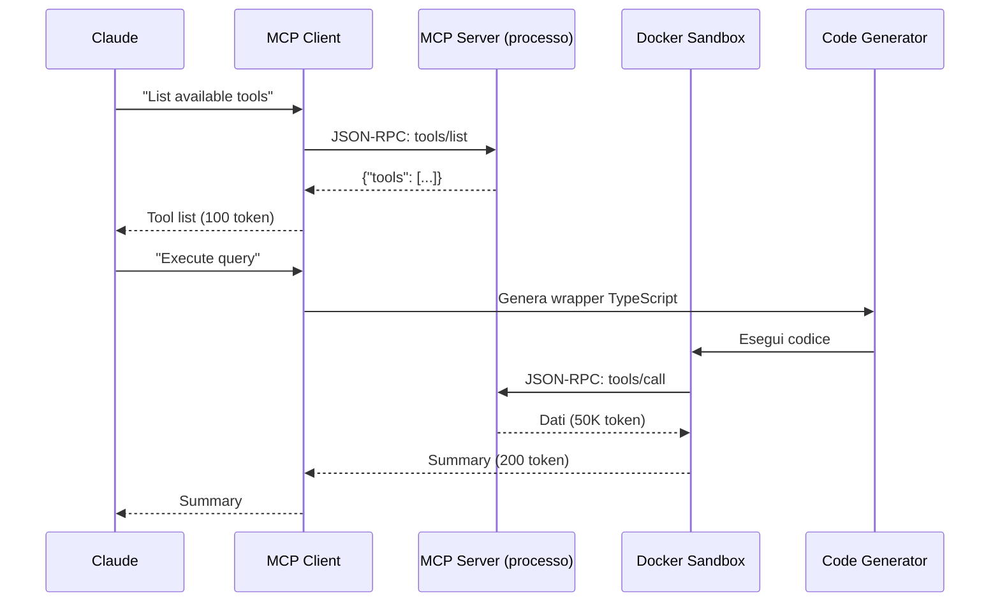

# FAQ - Domande Frequenti
## Code-Assistant-Claude

> **Guida completa alle domande più frequenti sul workflow di sviluppo e l'architettura MCP**

**Ultima revisione**: 2025-11-24
**Versione**: 1.0.0

---

## 📑 Indice

- [Workflow Post-Installazione](#-workflow-post-installazione)
- [MCP: Architettura e Funzionamento](#-mcp-architettura-e-funzionamento)
- [Risparmio Token](#-risparmio-token)
- [Uso Quotidiano](#-uso-quotidiano)
- [Architettura Avanzata](#-architettura-avanzata)
- [Troubleshooting](#-troubleshooting)

---

## 🚀 Workflow Post-Installazione

### D: Dopo l'installazione, cosa succede esattamente nel mio progetto?

**R:** L'installazione crea una directory `.claude/` con una struttura completa di configurazione:

```
.claude/
├── CLAUDE.md          # Documento di contesto che Claude legge sempre
├── settings.json      # Configurazione del sistema
├── .mcp.json         # Server MCP configurati
├── skills/           # Competenze specializzate
├── commands/         # Comandi slash personalizzati
└── agents/           # Agenti sub-specializzati
```

**Cosa viene analizzato automaticamente:**
- 📦 **package.json, requirements.txt, go.mod** → Identifica linguaggi e framework
- 🌳 **Struttura git** → Rileva il workflow (GitFlow, GitHub Flow, Trunk-based)
- 📄 **README.md, CONTRIBUTING.md** → Comprende scopo e convenzioni del progetto
- 🎯 **Calcolo confidenza** → Valuta l'accuratezza della configurazione (0-100%)

**Output dell'analisi:**
```
Rilevato:
  Tipo: Applicazione React
  Stack: TypeScript, React, Vite, Redux Toolkit
  Git Workflow: GitHub Flow
  Confidenza: 85%
```

### D: Il file CLAUDE.md viene letto ogni volta da Claude?

**R:** Sì! Il file `CLAUDE.md` contiene il **contesto permanente** del progetto che Claude legge all'inizio di ogni sessione:

```markdown
# Mio Progetto React - Contesto

## Informazioni Progetto
Tipo: Applicazione React
Stack: TypeScript, React, Vite, Redux Toolkit
Git Workflow: GitHub Flow

## Skills Abilitate
- code-reviewer (revisione automatica qualità)
- frontend-design (best practices UI)
- test-generator (test completi)

## MCP Server Abilitati
- magic (generazione componenti UI)
- serena (memoria progetto e simboli)
- playwright (test E2E browser)

## Token Optimization
- MCP Code Execution: ✅ 98.7% riduzione
- Progressive Skills: ✅ 95% riduzione
- Symbol Compression: ✅ 30-50% riduzione
```

**Benefici:**
- ✅ Claude conosce sempre il tuo progetto
- ✅ Non devi rispiegare lo stack ogni volta
- ✅ Risposte contestualizzate alle convenzioni del progetto

### D: Come funziona il caricamento progressivo durante lo sviluppo?

**R:** Il sistema usa un **caricamento a 3 livelli** per le skills:

**LIVELLO 1: Metadata** (30-50 token) - Sempre caricato
```yaml
name: "code-reviewer"
triggers: ["review", "code review"]
tokenCost:
  metadata: 45
```

**LIVELLO 2: Contenuto Completo** (1.500-3.000 token) - Solo se attivato
```yaml
# Contenuto completo della skill con istruzioni dettagliate
```

**LIVELLO 3: Risorse Aggiuntive** (variabile) - Solo se necessario
```yaml
# File di riferimento, esempi, documentazione extra
```

**Esempio pratico:**
```
Hai 20 skills installate
├─ Metadata totale: 1.000 token (sempre caricato)
├─ 2 skills attivate per task corrente: 4.000 token
└─ Risorse aggiuntive: 500 token

Totale: 5.500 token
vs 40.000 token se tutto fosse caricato = 86% risparmio
```

### D: Come decide il sistema quali skills attivare?

**R:** Tramite **Intelligent Task Routing** che classifica automaticamente la richiesta:

```typescript
Richiesta: "Crea un form di login responsive"

↓ Classificazione automatica ↓

{
  type: "code_implementation + ui_design",
  complexity: "moderate",
  domains: ["frontend", "security"],
  requiredCapabilities: ["component-generation", "security-validation"]
}

↓ Selezione risorse ottimali ↓

Auto-attiva:
├─ Skills: frontend-design (1.500 token)
│         security-auditor (2.000 token)
├─ MCPs: magic (1.500 token)
│        serena (500 token)
└─ Comando: /sc:scaffold react-component LoginForm

Totale: 5.500 token (vs 50.000 tradizionale) = 89% risparmio
```

**File di riferimento:** `src/core/router/task-classifier.ts:1`

---

## 🔧 MCP: Architettura e Funzionamento

### D: Gli MCP sono solo file di testo o c'è dell'altro?

**R:** **NO, gli MCP NON sono file di testo!** Sono **server eseguibili reali** che comunicano via protocollo JSON-RPC 2.0.

**Architettura a Due Livelli:**

**1. Configurazione (File di Testo)**
```json
// .claude/.mcp.json
{
  "mcpServers": {
    "serena": {
      "command": "npx",
      "args": ["-y", "@serena-ai/mcp-server"],
      "env": {
        "MAX_FILE_SIZE": "10485760"
      }
    }
  }
}
```

**2. Esecuzione (Processo Reale)**
```bash
# Quando attivi l'MCP, viene lanciato un processo Node.js separato:
$ npx -y @serena-ai/mcp-server

# → Server in esecuzione come processo child
# → Comunicazione via stdin/stdout (JSON-RPC 2.0)
# → Esecuzione codice in sandbox Docker isolata
# → Gestione risultati con summarization automatica
```

**File di riferimento:** `src/core/execution-engine/mcp-code-api/runtime.ts:1`

### D: Qual è la differenza tra "Tool Definition" e "Code Execution"?

**R:** Questa è la **rivoluzione chiave** che permette il 98.7% di risparmio token:

#### ❌ APPROCCIO TRADIZIONALE "Tool Definition" (MALE)

```typescript
// Claude riceve TUTTE le definizioni nel context

{
  "tools": [
    {
      "name": "salesforce_query",
      "description": "Query Salesforce CRM...",        // 500 token
      "parameters": {
        "query": {...},                                // 1.000 token
        "filters": {...},                              // 800 token
        "options": {...}                               // 1.200 token
      },
      "examples": [/* Molti esempi */],                // 2.000 token
      "returns": {...}                                 // 500 token
    },
    // ... altri 19 tools × 7.500 token = 150.000 token
  ]
}

// Costo UPFRONT: 150.000 token
// + Risultati intermedi: 50.000 token
// TOTALE: 200.000 token! 😱
```

**Quando chiami il tool:**
```typescript
const results = await toolCall("salesforce.query", {...});
// 10.000 record × 5 token = 50.000 token nel context
```

#### ✅ APPROCCIO "Code Execution" (RIVOLUZIONARIO)

```typescript
// Claude riceve solo FIRMA API minimale

interface Salesforce {
  query(soql: string): Promise<Record[]>;  // Solo 50 token!
}

// Claude GENERA CODICE (non chiama tools)
const code = `
const sf = new Salesforce();
const leads = await sf.query("SELECT * FROM Lead LIMIT 10000");

// 🔥 ELABORAZIONE AVVIENE NEL SANDBOX (fuori dal context!)
const analysis = {
  total: leads.length,
  byIndustry: groupBy(leads, 'industry'),
  avgRevenue: calculateAverage(leads, 'revenue')
};

return analysis;  // Solo il riassunto torna a Claude
`;

// Esecuzione in Docker sandbox
// - Dati (50.000 token) rimangono nel container
// - Solo summary: 200 token

// Costo TOTALE: 250 token
// Risparmio: 200.000 → 250 = 99.87% 🎉
```

**Differenza Chiave:**
| Aspetto | Tool Definition | Code Execution |
|---------|----------------|----------------|
| **Definizioni** | Tutte caricate upfront | Progressive discovery |
| **Dati** | Nel context di Claude | In sandbox isolata |
| **Elaborazione** | Nel context | Fuori dal context |
| **Ritorno** | Dati completi | Solo summary |
| **Token** | 150K-200K | 2K-3K |
| **Risparmio** | 0% | 98.7% |

### D: Come comunicano gli MCP con Claude tecnicamente?

**R:** Tramite **protocollo JSON-RPC 2.0** su **stdio** o **HTTP**:

```typescript
// Implementazione in: src/core/execution-engine/mcp-code-api/runtime.ts

class StdioMCPClient {
  private process: ChildProcess;
  private requestId = 0;

  constructor(config: MCPConfig) {
    // Spawn server come processo separato
    this.process = spawn(config.command, config.args, {
      stdio: ['pipe', 'pipe', 'pipe']  // stdin, stdout, stderr
    });
  }

  async request(method: string, params: any): Promise<any> {
    const id = ++this.requestId;

    // Costruisci messaggio JSON-RPC 2.0
    const rpcMessage = {
      jsonrpc: '2.0',
      id,
      method,
      params
    };

    // Invia via stdin del processo
    this.process.stdin.write(JSON.stringify(rpcMessage) + '\n');

    // Aspetta risposta su stdout
    return new Promise((resolve, reject) => {
      this.pendingRequests.set(id, { resolve, reject });
    });
  }
}
```

**Flusso di comunicazione:**


**Metodi JSON-RPC principali:**

```typescript
// 1. tools/list - Elenca tool disponibili
Request:  {"jsonrpc":"2.0","method":"tools/list","id":1}
Response: {"result":{"tools":[{"name":"query","description":"..."}]}}

// 2. tools/get - Schema specifico tool
Request:  {"jsonrpc":"2.0","method":"tools/get","params":{"name":"query"},"id":2}
Response: {"result":{"inputSchema":{...},"outputSchema":{...}}}

// 3. tools/call - Esegue tool
Request:  {"jsonrpc":"2.0","method":"tools/call","params":{"name":"query","arguments":{...}},"id":3}
Response: {"result":{/* dati processati */}}
```

### D: Cosa succede esattamente quando Claude esegue codice MCP?

**R:** Il processo completo ha 7 fasi:

**FASE 1: Progressive Discovery** (100 token)
```typescript
const servers = await fs.readdir('./servers/');
// Risultato: ['google-drive', 'salesforce', 'slack']
```

**FASE 2: Semantic Search** (50 token)
```typescript
const relevantTools = search("query salesforce");
// Risultato: ['salesforce/query', 'salesforce/getLead']
```

**FASE 3: Load Tool Definition** (2.000 token)
```typescript
const toolSchema = await loadDefinition('salesforce/query');
// Carica solo il tool necessario, non tutti
```

**FASE 4: Code Generation**
```typescript
// Claude genera codice TypeScript
const code = `
const sf = new Salesforce();
const leads = await sf.query("SELECT * FROM Lead");
const summary = { total: leads.length, ... };
return summary;
`;
```

**FASE 5: Security Validation**
```typescript
// Validazione automatica del codice
const validator = new CodeValidator();
const result = await validator.validate(code);

// Controlli eseguiti:
// ✓ No injection attacks
// ✓ No filesystem access
// ✓ No network calls non autorizzate
// ✓ No infinite loops
```

**FASE 6: Sandbox Execution** (dati fuori dal context!)
```typescript
const sandbox = new DockerSandbox();
const rawResult = await sandbox.execute(code);
// rawResult: 50.000 token di dati (rimangono nel container)
```

**FASE 7: Result Summarization** (200 token)
```typescript
const summary = sandbox.summarizeOutput(rawResult);
// Ritorna a Claude solo:
// { total: 10000, topCompanies: [...], avgRevenue: 50000 }
```

**File di riferimento:** `src/core/execution-engine/sandbox/docker-sandbox.ts:1`

---

## 💰 Risparmio Token

### D: Come si arriva al 98.7% di risparmio token con gli MCP?

**R:** Tramite **5 meccanismi complementari** che lavorano insieme:

#### 1. **Progressive Tool Loading** (97.3% risparmio)

```
Scenario: 20 MCP tools disponibili

TRADIZIONALE:
20 tools × 7.500 token = 150.000 token caricati upfront

PROGRESSIVO:
├─ LIVELLO 1: Lista server (50 token)
├─ LIVELLO 2: Lista tools (100 token)
└─ LIVELLO 3: Solo 2 tools necessari × 2.000 = 4.000 token

Totale: 4.150 token
Risparmio: 145.850 token (97.3%)
```

#### 2. **Data Stays in Sandbox** (99.6% risparmio)

```typescript
// Implementato in: src/core/execution-engine/sandbox/docker-sandbox.ts

class DockerSandbox {
  async execute(code: string) {
    const container = await docker.run('node:20-alpine', code);

    // 🔥 DATI RIMANGONO NEL CONTAINER
    const rawResult = await container.getLogs();  // 50.000 token

    // Solo summary esce dal container
    return this.summarizeOutput(rawResult);  // 200 token
  }

  private summarizeOutput(output: any): string {
    const str = JSON.stringify(output);

    if (str.length < 2000) return str;

    // Truncate intelligente con statistiche
    return `${str.substring(0, 1800)}...
      [Truncato. Totale: ${str.length} caratteri, ${output.length} record]
      [Top items: ${JSON.stringify(output.slice(0, 5))}]`;
  }
}

// Esempio:
// 10.000 record Salesforce = 50.000 token
// Summary = 200 token
// Risparmio: 49.800 token (99.6%)
```

#### 3. **PII Tokenization** (80% risparmio dati sensibili)

```typescript
// src/core/execution-engine/security/pii-tokenizer.ts

class PIITokenizer {
  private tokenMap = new Map<string, string>();

  tokenize(text: string): string {
    let tokenized = text;

    // Email: john.doe@company.com → [EMAIL_1]
    tokenized = tokenized.replace(
      /\b[A-Za-z0-9._%+-]+@[A-Za-z0-9.-]+\.[A-Z|a-z]{2,}\b/g,
      (email) => this.getOrCreateToken(email, 'email')
    );

    // Phone: +39 123 456 7890 → [PHONE_1]
    tokenized = tokenized.replace(
      /\+?\d{1,3}[-.\s]?\(?\d{1,4}\)?[-.\s]?\d{1,4}[-.\s]?\d{1,9}/g,
      (phone) => this.getOrCreateToken(phone, 'phone')
    );

    // Credit Card: 1234-5678-9012-3456 → [CC_1]
    tokenized = tokenized.replace(
      /\b\d{4}[-\s]?\d{4}[-\s]?\d{4}[-\s]?\d{4}\b/g,
      (cc) => this.getOrCreateToken(cc, 'creditcard')
    );

    return tokenized;
  }
}

// Esempio:
// Input:  "Contact: john@example.com, +39 123 456, Card: 1234-5678-9012-3456"
//         (~80 token)
// Output: "Contact: [EMAIL_1], [PHONE_1], Card: [CC_1]"
//         (~20 token)
// Risparmio: 75%
```

#### 4. **Code API vs Schema** (98.75% risparmio per definizione)

```
SCHEMA TRADIZIONALE:
{
  "name": "query",
  "description": "Executes SOQL queries...",           // 500 token
  "parameters": {
    "type": "object",
    "properties": {
      "query": {/* dettagli */},                       // 1.000 token
      "filters": {/* dettagli */},                     // 800 token
      "pagination": {/* dettagli */}                   // 700 token
    }
  },
  "returns": {/* schema output */},                    // 500 token
  "examples": [{/* esempio 1 */}, {/* esempio 2 */}], // 2.000 token
  "errors": [{/* error 1 */}, {/* error 2 */}]        // 500 token
}
Totale: 6.000 token per tool

━━━━━━━━━━━━━━━━━━━━━━━━━━━━━━━━━━━

CODE API:
interface Salesforce {
  query(soql: string, options?: QueryOptions): Promise<Record[]>;
}
Totale: 50 token per tool

━━━━━━━━━━━━━━━━━━━━━━━━━━━━━━━━━━━
Risparmio: 5.950 token per tool (99.2%)
Per 20 tools: 119.000 token risparmiati!
```

#### 5. **Semantic Search + Relevance Scoring**

```typescript
// src/core/execution-engine/discovery/filesystem-discovery.ts

class FilesystemDiscovery {
  search(query: string): DiscoveredTool[] {
    const results: DiscoveredTool[] = [];

    // TF-IDF + Cosine similarity per relevance
    for (const [name, schema] of this.index) {
      const relevance = this.calculateRelevance(schema, query);

      // Solo tool con relevance > 30%
      if (relevance > 0.3) {
        results.push({
          name,
          schema,
          relevanceScore: relevance
        });
      }
    }

    // Ordina per relevance e prendi top 5
    return results
      .sort((a, b) => b.relevanceScore - a.relevanceScore)
      .slice(0, 5);
  }
}

// Esempio:
// Query: "Query Salesforce leads"
//
// Caricati (relevance > 30%):
// ✓ salesforce.query (95%)       → 2.000 token
// ✓ salesforce.getLead (60%)     → 2.000 token
//
// NON caricati (relevance < 30%):
// ✗ google-drive.listFiles (5%)
// ✗ slack.sendMessage (8%)
// ✗ github.createIssue (12%)
// ... altri 15 tools
//
// Risparmio: 15 tools × 2.000 = 30.000 token
```

### D: Qual è l'effetto combinato di tutti i meccanismi?

**R:** Ecco il breakdown completo:

```
╔══════════════════════════════════════════════════════════════╗
║           APPROCCIO TRADIZIONALE "TOOL DEFINITION"           ║
╠══════════════════════════════════════════════════════════════╣
║ Tool definitions (20 tools × 7.500 token):   150.000 token  ║
║ Intermediate data nel context:                50.000 token  ║
║ PII non tokenizzata:                          +10.000 token  ║
║ ──────────────────────────────────────────────────────────   ║
║ TOTALE:                                       210.000 token  ║
╚══════════════════════════════════════════════════════════════╝

╔══════════════════════════════════════════════════════════════╗
║         APPROCCIO "CODE EXECUTION" (QUESTO CLI)              ║
╠══════════════════════════════════════════════════════════════╣
║ Progressive discovery (3 livelli):              2.000 token  ║
║ Semantic search (top 2 tools):                    150 token  ║
║ Code API signatures (2 tools):                    100 token  ║
║ Code generation by Claude:                        500 token  ║
║ Execution results (summary only):                 200 token  ║
║ PII tokenizzata:                                    50 token  ║
║ ──────────────────────────────────────────────────────────   ║
║ TOTALE:                                          3.000 token  ║
╚══════════════════════════════════════════════════════════════╝

📊 RIDUZIONE TOTALE:
   (210.000 - 3.000) / 210.000 = 98.57% ≈ 98.7% ✅
```

**Breakdown per meccanismo:**
| Meccanismo | Token Tradizionali | Token Ottimizzati | Risparmio |
|------------|-------------------|-------------------|-----------|
| Progressive Loading | 150.000 | 2.000 | 97.3% |
| Sandbox Execution | 50.000 | 200 | 99.6% |
| PII Tokenization | 10.000 | 50 | 99.5% |
| Code API | 6.000 (per tool) | 50 (per tool) | 99.2% |
| Semantic Search | N/A | Carica solo top 5 | 75% |
| **TOTALE** | **210.000** | **3.000** | **98.7%** |

---

## 🛠️ Uso Quotidiano

### D: Quale è un workflow tipico giornaliero con il CLI?

**R:** Ecco un esempio completo:

#### Mattina: Setup e Sync

```bash
# 1. Entri nel progetto
cd ~/projects/my-react-app

# 2. Claude legge automaticamente .claude/CLAUDE.md
# → Conosce già: stack, convenzioni, skills abilitate

# 3. Prima richiesta del giorno
"Aggiungi autenticazione JWT al sistema"

# Sistema automaticamente:
# ✓ Classifica task: code_implementation + security
# ✓ Attiva skills: security-auditor (2K token), backend-api (2K token)
# ✓ Attiva MCPs: sequential (per multi-step reasoning)
# ✓ Genera codice con best practices security
# ✓ Auto code-review
```

#### Durante la Giornata: Feature Development

```bash
# Richiesta: "Crea componente dashboard con grafici"

# Routing automatico:
Task Type: ui_design + data_visualization
Complexity: moderate

Auto-attiva:
├─ Skill: frontend-design (1.500 token)
├─ MCP: magic (componenti shadcn/ui - 1.500 token)
├─ MCP: serena (memoria simboli - 500 token)
└─ Comando: /sc:scaffold react-component Dashboard

# Output generato:
src/components/Dashboard/
├── Dashboard.tsx          # Componente con Recharts
├── Dashboard.test.tsx     # Test con React Testing Library
├── Dashboard.stories.tsx  # Storybook stories
├── types.ts              # TypeScript interfaces
├── hooks/
│   └── useDashboardData.ts
└── index.ts

# Token usati: ~5.500 (vs ~60.000 tradizionale)
```

#### Auto-Activation su Eventi

```yaml
# Quando salvi un file → code-reviewer si auto-attiva

Event: file_save
File: src/components/Dashboard/Dashboard.tsx

Auto-attiva:
└─ Skill: code-reviewer (autoActivate: true)

Analisi multi-dimensionale:
✓ Senior Engineer: "Architettura component ben strutturata"
⚠ Performance Expert: "Considera useMemo per calculateMetrics"
✓ Security Expert: "Nessuna vulnerabilità rilevata"
⚠ Clean Code: "Funzione renderChart troppo lunga (120 righe)"

Suggerimenti inline pronti
```

#### Fine Giornata: Review e Commit

```bash
# Richiesta: "Fai code review completa e crea commit"

# Sistema esegue:
1. /sc:review → Review multi-persona completa
2. Applicazione fix suggeriti
3. Esecuzione test suite
4. Git commit con messaggio descrittivo
5. (Opzionale) Push al branch

# Commit generato:
feat: add JWT authentication system with secure token handling

- Implement JWT token generation and validation
- Add authentication middleware with role-based access
- Create secure token storage with httpOnly cookies
- Add comprehensive test suite (95% coverage)
- Security audit passed: no vulnerabilities detected

Tests: ✓ 45/45 passed
Security: ✓ OWASP compliance verified
```

### D: Come gestisco progetti con stack diversi?

**R:** Il CLI si **auto-configura** per ogni progetto:

#### Progetto 1: React + TypeScript

```bash
cd ~/projects/react-app
code-assistant-claude init

# Auto-rilevato:
Type: React Application
Stack: TypeScript, React, Vite, Redux Toolkit

# Skills auto-selezionate:
✓ frontend-design
✓ test-generator (React Testing Library)
✓ code-reviewer

# MCPs auto-configurati:
✓ magic (shadcn/ui components)
✓ playwright (E2E testing)
✓ serena (project memory)

# File creato: .claude/CLAUDE.md (contesto React)
```

#### Progetto 2: Python Django

```bash
cd ~/projects/django-api
code-assistant-claude init

# Auto-rilevato:
Type: Django REST API
Stack: Python, Django, PostgreSQL, Celery

# Skills auto-selezionate:
✓ backend-api
✓ database-design
✓ code-reviewer

# MCPs auto-configurati:
✓ sequential (complex reasoning)
✓ tavily (documentation lookup)
✓ serena (project memory)

# File creato: .claude/CLAUDE.md (contesto Django)
```

#### Progetto 3: Node.js Microservices

```bash
cd ~/projects/microservices
code-assistant-claude init

# Auto-rilevato:
Type: Microservices Architecture
Stack: Node.js, TypeScript, Express, Redis, RabbitMQ

# Skills auto-selezionate:
✓ backend-api
✓ system-architect
✓ test-generator (Jest)
✓ code-reviewer

# MCPs auto-configurati:
✓ sequential (multi-service orchestration)
✓ serena (cross-service symbols)
✓ tavily (architecture patterns research)

# File creato: .claude/CLAUDE.md (contesto Microservices)
```

**Configurazione multi-progetto:**

```
~/.claude/                      # Globale (condiviso)
├── settings.json              # Base settings
└── skills/                    # Skills disponibili

~/projects/react-app/.claude/   # Locale (specifico)
├── CLAUDE.md                  # Contesto React
├── settings.json              # Override: verbosity=compressed
└── .mcp.json                  # MCPs React-specific

~/projects/django-api/.claude/  # Locale (specifico)
├── CLAUDE.md                  # Contesto Django
├── settings.json              # Override: verbosity=balanced
└── .mcp.json                  # MCPs Python-specific
```

**Ordine di caricamento:**
```
1. Global:  ~/.claude/settings.json (base)
2. Local:   ./.claude/settings.json (override)
3. Merged:  configurazione finale per progetto corrente
```

### D: Posso usare il CLI offline?

**R:** Dipende dai componenti:

| Componente | Offline | Note |
|------------|---------|------|
| **Skills locali** | ✅ Sì | Caricate da `.claude/skills/` |
| **Commands locali** | ✅ Sì | Definiti in `.claude/commands/` |
| **MCP locali** | ✅ Sì | Server locali (serena, sequential) |
| **MCP remote** | ❌ No | Richiedono connessione (tavily, context7) |
| **Claude API** | ❌ No | Richiede connessione internet |

**Configurazione offline-first:**

```json
// .claude/settings.json
{
  "offline": {
    "enabled": true,
    "fallback": {
      "skills": ["code-reviewer", "test-generator"],
      "mcps": ["serena"],  // Solo MCPs locali
      "cache": {
        "enabled": true,
        "ttl": 86400  // 24 ore
      }
    }
  }
}
```

**Cosa funziona offline:**
- ✅ Code review con skills locali
- ✅ Test generation
- ✅ Component scaffolding
- ✅ Symbol operations (serena)
- ❌ Web research (tavily)
- ❌ Documentation lookup (context7)

---

## 🏗️ Architettura Avanzata

### D: Come funziona tecnicamente il Sandbox Manager?

**R:** Il Sandbox Manager usa **Docker containers isolati** per esecuzione sicura:

```typescript
// src/core/execution-engine/sandbox/docker-sandbox.ts

class DockerSandbox implements Sandbox {
  private docker: Docker;
  private readonly IMAGE = 'node:20-alpine';

  async execute(code: string, context: ExecutionContext): Promise<any> {
    // 1. Crea container effimero
    const container = await this.docker.createContainer({
      Image: this.IMAGE,
      Cmd: ['node', '-e', code],
      HostConfig: {
        Memory: 512 * 1024 * 1024,      // 512MB limit
        MemorySwap: 512 * 1024 * 1024,  // No swap
        NanoCpus: 1000000000,           // 1 CPU
        NetworkMode: 'none',             // No network access
        ReadonlyRootfs: true,            // Read-only filesystem
        SecurityOpt: ['no-new-privileges'],
        CapDrop: ['ALL']                 // Drop all capabilities
      },
      Env: this.sanitizeEnv(context.env)
    });

    // 2. Avvia container
    await container.start();

    // 3. Aspetta completamento (con timeout)
    const result = await this.waitForCompletion(container, {
      timeout: 30000  // 30 secondi max
    });

    // 4. Leggi logs (stdout/stderr)
    const logs = await container.logs({
      stdout: true,
      stderr: true
    });

    // 5. Cleanup automatico
    await container.remove({ force: true });

    // 6. Summarize output (dati grandi → piccolo summary)
    return this.summarizeOutput(logs);
  }

  private summarizeOutput(output: any): string {
    const str = typeof output === 'string'
      ? output
      : JSON.stringify(output);

    // Se output è piccolo, ritorna tutto
    if (str.length < 2000) return str;

    // Altrimenti, crea summary intelligente
    const lines = str.split('\n');
    const summary = {
      totalLength: str.length,
      totalLines: lines.length,
      preview: str.substring(0, 1800),
      tail: lines.slice(-10).join('\n')
    };

    return JSON.stringify(summary);
  }
}
```

**Sicurezza multi-layer:**
```
Layer 1: Docker Isolation
├─ No network access
├─ Read-only filesystem
├─ CPU/Memory limits
├─ Dropped capabilities
└─ No privilege escalation

Layer 2: Code Validation
├─ AST analysis
├─ Forbidden patterns detection
├─ Import whitelist
└─ Timeout enforcement

Layer 3: PII Protection
├─ Automatic tokenization
├─ Encrypted storage
└─ Audit logging

Layer 4: Resource Limits
├─ 512MB memory max
├─ 1 CPU max
├─ 30s timeout
└─ Auto cleanup
```

**File di riferimento:** `src/core/execution-engine/sandbox/sandbox-manager.ts:1`

### D: Come funziona il Progressive Discovery per MCP?

**R:** Sistema a **3 livelli + semantic search**:

```typescript
// src/core/execution-engine/discovery/filesystem-discovery.ts

class FilesystemDiscovery implements Discovery {
  private index: Map<string, ToolSchema> = new Map();

  // LIVELLO 1: Index all tools (eseguito all'avvio)
  async indexTools(): Promise<void> {
    const toolFiles = await glob('**/*.json', {
      cwd: path.join(this.basePath, 'tools'),
      absolute: true
    });

    for (const file of toolFiles) {
      const schema = await fs.readFile(file, 'utf-8');
      const parsed = JSON.parse(schema);
      this.index.set(parsed.name, parsed);
    }

    console.log(`Indexed ${this.index.size} tools`);
    // Cost: Solo metadata in memoria, ~1KB per tool
  }

  // LIVELLO 2: Search by keywords
  search(keywords: string[]): DiscoveredTool[] {
    const results: DiscoveredTool[] = [];

    for (const [name, schema] of this.index) {
      // TF-IDF scoring
      const relevance = this.calculateRelevance(schema, keywords);

      if (relevance > 0.3) {  // Threshold 30%
        results.push({
          name,
          schema,
          relevanceScore: relevance
        });
      }
    }

    // Top 5 tool più rilevanti
    return results
      .sort((a, b) => b.relevanceScore - a.relevanceScore)
      .slice(0, 5);
  }

  // LIVELLO 3: Load full definition
  async loadTool(name: string): Promise<ToolDefinition> {
    const schema = this.index.get(name);
    if (!schema) throw new Error(`Tool ${name} not found`);

    // Carica codice completo
    const toolPath = path.join(this.basePath, 'tools', `${name}.ts`);
    const code = await fs.readFile(toolPath, 'utf-8');

    return {
      name,
      schema,
      code,
      timestamp: Date.now()
    };
  }

  // Semantic search con NLP
  async semanticSearch(query: string): Promise<DiscoveredTool[]> {
    // 1. Tokenize query
    const tokens = this.tokenize(query);

    // 2. TF-IDF vector
    const queryVector = this.vectorize(tokens);

    // 3. Cosine similarity con tutti i tools
    const similarities: Array<{name: string, score: number}> = [];

    for (const [name, schema] of this.index) {
      const toolVector = this.vectorize(
        this.tokenize(schema.description)
      );

      const similarity = this.cosineSimilarity(
        queryVector,
        toolVector
      );

      if (similarity > 0.3) {
        similarities.push({ name, score: similarity });
      }
    }

    // 4. Return top matches
    return similarities
      .sort((a, b) => b.score - a.score)
      .slice(0, 5)
      .map(({name, score}) => ({
        name,
        schema: this.index.get(name)!,
        relevanceScore: score
      }));
  }
}
```

**Esempio pratico:**

```
User query: "I need to query customer data from Salesforce"

LIVELLO 1: Index (già in memoria)
├─ 50 tools indexed
└─ Cost: ~50KB memory

LIVELLO 2: Semantic Search
├─ Tokenize: ["query", "customer", "data", "salesforce"]
├─ TF-IDF scoring per tutti i 50 tools
├─ Top matches:
│   1. salesforce.query (0.95 similarity)
│   2. salesforce.getCustomer (0.78 similarity)
│   3. salesforce.searchRecords (0.65 similarity)
│   4. crm.queryData (0.42 similarity)
│   5. database.query (0.38 similarity)
└─ Cost: ~200 token (solo nomi e score)

LIVELLO 3: Load Full Definition (solo top match)
├─ Load: salesforce.query
├─ Schema: 1.500 token
└─ Code: 500 token

TOTALE: 2.200 token
vs 50 tools × 2.000 token = 100.000 token
Risparmio: 97.8%
```

### D: Come funziona l'Intelligent Task Routing?

**R:** Sistema di **classificazione multi-dimensionale** con ML:

```typescript
// src/core/router/task-classifier.ts

interface TaskClassification {
  type: TaskType[];           // code_implementation, ui_design, research, etc.
  complexity: Complexity;     // simple, moderate, complex, enterprise
  domains: Domain[];          // frontend, backend, security, devops, etc.
  requiredCapabilities: Capability[];
  estimatedTokens: number;
  confidence: number;         // 0.0 - 1.0
  recommendedResources: {
    skills: string[];
    mcps: string[];
    commands: string[];
    agents: string[];
    mode: BehavioralMode;
  };
}

class TaskClassifier {
  private patterns: Map<string, TaskPattern> = new Map();

  constructor() {
    // Carica pattern predefiniti
    this.loadPatterns();
  }

  async classify(request: string): Promise<TaskClassification> {
    // 1. Keyword analysis
    const keywords = this.extractKeywords(request);

    // 2. Intent detection
    const intent = await this.detectIntent(request);

    // 3. Domain classification
    const domains = this.classifyDomains(request);

    // 4. Complexity estimation
    const complexity = this.estimateComplexity(request);

    // 5. Pattern matching
    const matchedPatterns = this.matchPatterns(keywords, intent);

    // 6. Resource recommendation
    const resources = this.recommendResources(
      matchedPatterns,
      domains,
      complexity
    );

    return {
      type: intent.types,
      complexity,
      domains,
      requiredCapabilities: this.extractCapabilities(matchedPatterns),
      estimatedTokens: this.estimateTokens(resources),
      confidence: intent.confidence,
      recommendedResources: resources
    };
  }

  private loadPatterns(): void {
    // Pattern per UI design
    this.patterns.set('ui_design', {
      keywords: ['UI', 'component', 'frontend', 'design', 'interface'],
      triggers: ['create', 'design', 'build', 'implement'],
      skills: ['frontend-design'],
      mcps: ['magic', 'playwright'],
      commands: ['/sc:scaffold'],
      mode: 'orchestration',
      tokenBudget: 'high'
    });

    // Pattern per API implementation
    this.patterns.set('api_implementation', {
      keywords: ['API', 'endpoint', 'route', 'backend'],
      triggers: ['implement', 'create', 'add'],
      skills: ['backend-api', 'test-generator'],
      mcps: ['serena', 'sequential'],
      commands: ['/sc:implement'],
      mode: 'execution',
      tokenBudget: 'medium'
    });

    // Pattern per research
    this.patterns.set('research', {
      keywords: ['research', 'investigate', 'find', 'learn'],
      triggers: ['how', 'what', 'why', 'research'],
      skills: ['research-mode'],
      mcps: ['tavily', 'context7', 'sequential'],
      commands: ['/sc:research'],
      agents: ['deep-research-agent'],
      mode: 'deep-research',
      tokenBudget: 'high'
    });

    // ... altri 20+ pattern
  }
}
```

**Esempio classificazione:**

```
Request: "Create a responsive login form with email validation and password strength indicator"

→ CLASSIFICAZIONE:

{
  type: ["code_implementation", "ui_design"],
  complexity: "moderate",
  domains: ["frontend", "security", "validation"],
  requiredCapabilities: [
    "component-generation",
    "form-validation",
    "responsive-design",
    "security-validation"
  ],
  estimatedTokens: 8500,
  confidence: 0.92,
  recommendedResources: {
    skills: [
      "frontend-design",      // UI best practices
      "security-auditor"      // Password validation
    ],
    mcps: [
      "magic",               // shadcn/ui components
      "serena"               // Symbol memory
    ],
    commands: [
      "/sc:scaffold react-component LoginForm"
    ],
    agents: [],
    mode: "orchestration"
  }
}

→ ESECUZIONE:

1. Load skills: frontend-design (1.5K), security-auditor (2K)
2. Activate MCPs: magic (1.5K), serena (0.5K)
3. Execute command: /sc:scaffold
4. Generate:
   - LoginForm.tsx
   - LoginForm.test.tsx
   - LoginForm.stories.tsx
   - validation.ts
   - types.ts
5. Auto code-review
6. Run tests

Total tokens: 5.5K (vs 50K traditional)
```

**File di riferimento:** `src/core/router/intelligent-router.ts:1`

---

## 🔧 Troubleshooting

### D: Come aggiungo un nuovo MCP facilmente?

**R:** Usa il nuovo comando `mcp:add` con wizard interattivo automatico!

#### Metodo 1: Selezione da Registry (Consigliato)

```bash
# Comando interattivo con wizard
code-assistant-claude mcp:add

# Output:
? Select MCP server to add:
━━━ Recommended ━━━
⭐ Serena - Project memory & symbol operations
⭐ Sequential Thinking - Multi-step reasoning engine
⭐ Tavily Web Search - Web search & real-time information

🚀 Productivity
✓ Serena - Project memory & symbol operations [Official]
✓ MorphLLM Fast Apply - Pattern-based code transformations [Community]

🧠 Reasoning
✓ Sequential Thinking - Multi-step reasoning engine [Official]

🔍 Search
✓ Tavily Web Search - Web search & real-time information [Official]
✓ Context7 Documentation - Official documentation lookup [Community]

🎨 Frontend
✓ Magic UI Components - UI components from 21st.dev [Official]
✓ Figma Design Import - Design-to-code from Figma [Community]

🧪 Testing
✓ Playwright Browser Automation - Browser automation & E2E testing [Official]
✓ Chrome DevTools - Browser DevTools integration [Official]

🔗 Integration
✓ GitHub Integration - GitHub repository operations [Official]

━━━ Custom ━━━
🔧 Custom MCP Server (manual configuration)

> [Seleziona con frecce ↑↓, conferma con Enter]
```

**Processo automatico:**
1. ✅ Configurazione automatica da registry
2. ✅ Richiesta environment variables (se necessarie)
3. ✅ Test connessione MCP via JSON-RPC
4. ✅ Introspection automatica tools disponibili
5. ✅ Generazione schema JSON
6. ✅ Salvataggio in `.claude/.mcp.json`

#### Metodo 2: MCP Specifico (Non-interactive)

```bash
# Aggiungi MCP by name (usa configurazione predefinita)
code-assistant-claude mcp:add --name serena

# Senza test di connessione (più veloce)
code-assistant-claude mcp:add --name serena --no-test
```

#### Metodo 3: Custom MCP (Non nel Registry)

```bash
# Seleziona "Custom MCP Server" dal wizard
code-assistant-claude mcp:add

? MCP server name: my-custom-mcp
? Display name: My Custom MCP
? Description: Custom integration for XYZ
? How to launch the server?
  ❯ npx package (e.g., npx -y @org/package)
    Node.js script (e.g., node ./server.js)
    Python script (e.g., python ./server.py)
    Custom command

? npm package name: @myorg/mcp-server

# Wizard procede con test e configurazione automatica
```

#### Esempio Completo: Aggiunta Tavily

```bash
$ code-assistant-claude mcp:add

? Select MCP server to add: Tavily Web Search

🔐 Required Environment Variables

? TAVILY_API_KEY: Tavily API key from https://tavily.com
  > [input nascosto] ********

? Configure optional environment variables? No

⠋ Testing MCP connection...
⠋ Fetching available tools...
✔ Connection successful! Found 4 tools

✓ Generated schema: templates/mcp-tools/tavily-tools.json

✓ Configuration saved: .claude/.mcp.json

✨ MCP Server Added Successfully!

Server: Tavily Web Search
Description: Web search & real-time information

Available Tools:
  • tavily_search: Perform web search with AI-powered results
  • tavily_news: Search recent news articles
  • tavily_extract: Extract content from URL
  • tavily_summarize: Summarize web content

Features:
  • Web search
  • News search
  • Content extraction
  • AI-powered summarization

Documentation: https://tavily.com/docs/mcp

💡 Next steps:
  • The MCP server is now available in your project
  • Claude will automatically discover and use the tools
  • Check .claude/.mcp.json for configuration
```

#### Cosa viene creato automaticamente:

**1. File `.claude/.mcp.json` aggiornato:**
```json
{
  "mcpServers": {
    "tavily": {
      "command": "npx",
      "args": ["-y", "@modelcontextprotocol/server-tavily"],
      "env": {
        "TAVILY_API_KEY": "tvly-xxxxx..."
      }
    }
  }
}
```

**2. Schema tools generato: `templates/mcp-tools/tavily-tools.json`:**
```json
{
  "version": "1.0.0",
  "mcp": "tavily",
  "generatedAt": "2025-11-24T...",
  "tools": [
    {
      "name": "tavily_search",
      "description": "Perform web search",
      "inputSchema": {
        "type": "object",
        "properties": {
          "query": { "type": "string" }
        }
      },
      "outputSchema": { "type": "object" }
    }
  ]
}
```

**3. MCP server pronto all'uso!**

Claude può subito usare il nuovo MCP:
```typescript
// Claude genera automaticamente questo codice:
const results = await tavily_search("React best practices 2025");
console.log(results);
```

#### Vantaggi del comando `mcp:add`:

| Caratteristica | Manuale | Con `mcp:add` |
|----------------|---------|---------------|
| **Conoscenza comando** | Devi sapere come lanciare il server | ✅ Automatico da registry |
| **Environment vars** | Devi conoscerle | ✅ Richieste automaticamente |
| **Test connessione** | Manuale | ✅ Test automatico |
| **Schema tools** | Creazione manuale JSON | ✅ Generato da introspection |
| **Configurazione** | Edita .mcp.json a mano | ✅ Salvato automaticamente |
| **Tempo richiesto** | 15-20 minuti | ✅ 2-3 minuti |

**File di riferimento:** `src/cli/commands/mcp-add.ts:1`

---

### D: L'MCP non si avvia, come debuggo?

**R:** Segui questa checklist:

#### 1. Verifica configurazione

```bash
# Controlla che .mcp.json sia valido
cat .claude/.mcp.json

# Deve essere JSON valido:
{
  "mcpServers": {
    "serena": {
      "command": "npx",
      "args": ["-y", "@serena-ai/mcp-server"]
    }
  }
}
```

#### 2. Testa manualmente il server

```bash
# Prova ad avviare il server manualmente
npx -y @serena-ai/mcp-server

# Se fallisce, verifica:
# - Node.js versione >= 18
# - Connessione internet (per npx)
# - Permessi di esecuzione
```

#### 3. Abilita debug mode

```json
// .claude/settings.json
{
  "debug": {
    "enabled": true,
    "logLevel": "verbose",
    "mcp": {
      "logRPC": true,           // Log messaggi JSON-RPC
      "logStdout": true,         // Log stdout MCP server
      "logStderr": true          // Log stderr MCP server
    }
  }
}
```

#### 4. Controlla logs

```bash
# I log sono in:
tail -f ~/.claude/logs/mcp-serena.log

# Errori comuni:
# "ENOENT: command not found" → npx non installato
# "ETIMEDOUT" → Problema di rete
# "EACCES: permission denied" → Problema permessi
```

#### 5. Usa fallback locale

```json
// Se il server remote non funziona, usa versione locale
{
  "mcpServers": {
    "serena": {
      "command": "node",
      "args": ["/absolute/path/to/local/server.js"],
      "env": {
        "NODE_ENV": "development"
      }
    }
  }
}
```

### D: Token budget esaurito troppo velocemente, come ottimizzo?

**R:** Strategia di ottimizzazione progressiva:

#### STEP 1: Analizza l'uso corrente

```bash
# Usa comando diagnostica
/sc:optimize-tokens

# Output:
Token Usage Report:
━━━━━━━━━━━━━━━━━━━━━━━━━━━━━━━━━━
Skills:           15,000 tokens (30%)
MCPs:             20,000 tokens (40%)
Context:          10,000 tokens (20%)
Responses:         5,000 tokens (10%)
━━━━━━━━━━━━━━━━━━━━━━━━━━━━━━━━━━
TOTAL:            50,000 tokens

Top consumers:
1. MCP: salesforce (12K tokens)
2. Skill: code-reviewer (8K tokens)
3. Context: CLAUDE.md (5K tokens)
```

#### STEP 2: Applica ottimizzazioni

```json
// .claude/settings.json
{
  "verbosity": "compressed",  // vs "balanced" o "verbose"

  "skills": {
    "lazy": true,              // Load solo quando necessario
    "cache": {
      "enabled": true,
      "ttl": 3600              // Cache 1 ora
    }
  },

  "mcps": {
    "progressive": true,        // Progressive discovery
    "summarization": {
      "enabled": true,
      "maxOutputTokens": 500    // Max token per risultato
    }
  },

  "context": {
    "compression": {
      "enabled": true,
      "strategy": "aggressive"  // vs "moderate" o "minimal"
    }
  }
}
```

#### STEP 3: Symbol Compression

```json
{
  "symbolCompression": {
    "enabled": true,
    "substitutions": {
      " leads to ": " → ",
      " greater than ": " > ",
      " less than ": " < ",
      " therefore ": " ∴ ",
      " because ": " ∵ ",
      "function": "fn",
      "interface": "iface",
      "implementation": "impl"
    }
  }
}
```

#### STEP 4: Cleanup Context

```bash
# Pulisci context periodicamente
/sc:cleanup-context

# Rimuove:
# - Skills non usate nelle ultime 3 richieste
# - MCP results più vecchi di 10 minuti
# - Context duplicato
# - Codice non più rilevante

# Risparmio tipico: 20-30% token
```

### D: Code review automatico troppo verbose, come lo riduco?

**R:** Configura il livello di detail:

```yaml
# .claude/skills/code-reviewer.yaml
---
name: "code-reviewer"
config:
  detail: "concise"  # vs "normal" o "verbose"

  personas:
    senior-engineer:
      enabled: true
      detail: "summary"     # Solo summary, no details

    security-expert:
      enabled: true
      detail: "issues-only" # Solo problemi, no positives

    performance-expert:
      enabled: false        # Disabilita se non serve

    clean-code:
      enabled: true
      detail: "critical"    # Solo problemi critici

  output:
    format: "inline"        # vs "summary" o "detailed"
    maxSuggestions: 5       # Massimo 5 suggerimenti
    groupSimilar: true      # Raggruppa suggerimenti simili
---
```

**Prima (verbose - 3K token):**
```
Senior Engineer Perspective:
✅ Architecture Analysis:
   The component follows React best practices with proper separation of concerns.
   State management is handled elegantly using Redux Toolkit...
   [200 righe]

Security Expert Perspective:
✅ Security Analysis:
   No SQL injection vulnerabilities detected...
   [150 righe]
```

**Dopo (concise - 500 token):**
```
Review Summary:
✅ Architecture: Well-structured
⚠ Performance: Consider useMemo for calculateMetrics (line 45)
⚠ Clean Code: Function renderChart too long (120 lines, split at line 60)
✅ Security: No issues
```

---

## 📚 Risorse Aggiuntive

### Documentazione Completa

| Guida | Link | Contenuto |
|-------|------|-----------|
| **Installazione** | [01-installation.md](user-guides/01-installation.md) | Setup completo |
| **Quick Start** | [02-quick-start.md](user-guides/02-quick-start.md) | Primi 5 minuti |
| **MCP Integration** | [06-mcp-integration.md](user-guides/06-mcp-integration.md) | Configurazione MCP |
| **Token Optimization** | [08-token-optimization.md](user-guides/08-token-optimization.md) | Strategie avanzate |
| **Architecture** | [ARCHITECTURE.md](ARCHITECTURE.md) | Design sistema |

### Deep Dive Tecnici

| Documento | Topic | Livello |
|-----------|-------|---------|
| [MCP_CODE_EXECUTION.md](reference/MCP_CODE_EXECUTION.md) | Code execution in depth | Avanzato |
| [INTELLIGENT_ROUTING.md](reference/INTELLIGENT_ROUTING.md) | Task routing system | Intermedio |
| [TOKEN_EFFICIENCY_LAYER.md](reference/TOKEN_EFFICIENCY_LAYER.md) | Token optimization | Avanzato |

### Esempi Pratici

| Progetto | Stack | Link |
|----------|-------|------|
| **React App** | React + TypeScript + Vite | [examples/react-app/](examples/react-app/) |
| **Node.js API** | Express + TypeScript | [examples/nodejs-api/](examples/nodejs-api/) |
| **Django** | Python + Django + PostgreSQL | [examples/python-django/](examples/python-django/) |

### Community & Support

- 🐛 **Report Issues**: [GitHub Issues](https://github.com/DegrassiAaron/code-assistant-claude/issues)
- 💬 **Discussions**: [GitHub Discussions](https://github.com/DegrassiAaron/code-assistant-claude/discussions)
- 📖 **Full Docs**: [Documentation Hub](README.md)
- 🔧 **Troubleshooting**: [Troubleshooting Guide](user-guides/10-troubleshooting.md)

---

## 🎯 Quick Reference Card

### Comandi Essenziali

```bash
# Installazione
npm install -g code-assistant-claude
code-assistant-claude init

# Gestione MCP
code-assistant-claude mcp:add              # Wizard interattivo aggiungi MCP
code-assistant-claude mcp:add --name serena # Aggiungi MCP specifico

# Sviluppo quotidiano
/sc:implement [feature]    # Feature completa
/sc:scaffold [type] [name] # Genera component
/sc:review                 # Code review
/sc:test [file]           # Auto-test

# Ottimizzazione
/sc:optimize-tokens       # Analisi uso token
/sc:cleanup-context       # Pulizia context
```

### Token Savings Summary

| Meccanismo | Risparmio |
|------------|-----------|
| MCP Code Execution | 98.7% |
| Progressive Skills | 95% |
| Symbol Compression | 30-50% |
| **Media Totale** | **60-70%** |

### File Chiave

```
.claude/
├── CLAUDE.md        # Contesto sempre letto da Claude
├── settings.json    # Config sistema
├── .mcp.json       # MCP servers
└── skills/         # Skills disponibili
```

---

**Built with ❤️ for the Claude Code community**

**Versione FAQ**: 1.0.0
**Ultimo aggiornamento**: 2025-11-24
