# Code-Assistant-Claude Documentation

> **Intelligent self-configuring framework for Claude Code CLI optimization**

[]()
[]()
[]()

---

## 📚 Documentation Map

```mermaid
graph TB
    Start[Documentation Hub] --> UserGuides[👤 User Guides]
    Start --> DevGuides[⚙️ Developer Guides]
    Start --> Reference[📖 Technical Reference]
    Start --> Examples[💡 Examples]

    UserGuides --> Install[01. Installation]
    UserGuides --> QuickStart[02. Quick Start]
    UserGuides --> Config[03. Configuration]
    UserGuides --> Skills[04. Skills]
    UserGuides --> Commands[05. Commands]
    UserGuides --> MCP[06. MCP Integration]
    UserGuides --> Agents[07. Agents]
    UserGuides --> Tokens[08. Token Optimization]
    UserGuides --> Security[09. Security]
    UserGuides --> Troubleshoot[10. Troubleshooting]

    DevGuides --> Architecture[Architecture Overview]
    DevGuides --> DeepDive[Deep Dive Topics]
    DevGuides --> Implementation[Implementation Guides]

    Reference --> MCPExec[MCP Code Execution]
    Reference --> Routing[Intelligent Routing]
    Reference --> TokenEff[Token Efficiency Layer]
    Reference --> Reset[Reset & Uninstall]

    Examples --> React[React App]
    Examples --> NodeJS[Node.js API]
    Examples --> Django[Python Django]

    style Start fill:#e1f5ff
    style UserGuides fill:#ffe1e1
    style DevGuides fill:#e1ffe1
    style Reference fill:#fff9e1
    style Examples fill:#f0e1ff
```



---

## 🚀 Quick Navigation

### 💡 Start Here!

| Guide | Description | Time |
|-------|-------------|------|
| [**FAQ**](faq.md) | **Domande frequenti su workflow e MCP** | **10 min** |
| [Installation Guide](user-guides/01-installation.md) | Complete setup walkthrough | 5 min |
| [Quick Start Tutorial](user-guides/02-quick-start.md) | Your first 5 minutes | 5 min |
| [Configuration Guide](user-guides/03-configuration.md) | Customize your setup | 10 min |

### Core Features

| Feature | Guide | Key Benefit |
|---------|-------|-------------|
| **Skills** | [Skills Guide](user-guides/04-skills-guide.md) | Progressive loading, 95% token savings |
| **Commands** | [Commands Guide](user-guides/05-commands-guide.md) | Workflow automation |
| **MCP Integration** | [MCP Guide](user-guides/06-mcp-integration.md) | 98.7% token reduction |
| **Agents** | [Agents Guide](user-guides/07-agents-guide.md) | Multi-agent coordination |
| **Token Optimization** | [Token Guide](user-guides/08-token-optimization.md) | Achieve 90% savings |
| **Security** | [Security Guide](user-guides/09-security-best-practices.md) | Secure configurations |

### Advanced Topics

| Topic | Document | For |
|-------|----------|-----|
| **Architecture** | [Architecture Overview](architecture.md) | Understanding system design |
| **MCP Code Execution** | [MCP Execution](reference/mcp-code-execution.md) | Deep dive into 98.7% reduction |
| **Intelligent Routing** | [Routing System](reference/intelligent-routing.md) | Task classification & routing |
| **Token Efficiency** | [Token Layer](reference/token-efficiency-layer.md) | Optimization strategies |

---

## 📖 Documentation Structure

### 🎯 User Guides (`user-guides/`)
**Complete learning path** for all users, from installation to advanced features.


**Contents:**
1. [Installation Guide](user-guides/01-installation.md) - Prerequisites, installation, verification
2. [Quick Start Tutorial](user-guides/02-quick-start.md) - 5-minute productive setup
3. [Configuration Guide](user-guides/03-configuration.md) - Customization options
4. [Skills Guide](user-guides/04-skills-guide.md) - Master all available skills
5. [Commands Guide](user-guides/05-commands-guide.md) - Slash command reference
6. [MCP Integration Guide](user-guides/06-mcp-integration.md) - MCP server setup
7. [Agents Guide](user-guides/07-agents-guide.md) - Multi-agent coordination
8. [Token Optimization Guide](user-guides/08-token-optimization.md) - Achieve 90% savings
9. [Security Best Practices](user-guides/09-security-best-practices.md) - Secure configurations
10. [Troubleshooting Guide](user-guides/10-troubleshooting.md) - Common issues and solutions

---

### ⚙️ Advanced Guides (`guides/`)
**Deep technical guides** for advanced customization and development.

- [Creating Custom Skills](guides/creating-skills.md) - Build your own skills
- [Creating Custom Commands](guides/creating-commands.md) - Custom slash commands
- [Creating Custom Agents](guides/creating-agents.md) - Specialized sub-agents
- [Advanced Optimization](guides/advanced-optimization.md) - Expert-level optimization
- [MCP Integration Patterns](guides/mcp-integration.md) - Advanced MCP usage
- [Security Configuration](guides/security-configuration.md) - Enterprise security setup

---

### 🏗️ Architecture & Design

#### System Architecture
[architecture.md](architecture.md) - Complete system design with diagrams


#### Deep Dive Topics (`deep-dive/`)
**Technical implementation details** for contributors and advanced users.

- [Project Analyzer Implementation](deep-dive/project-analyzer-implementation.md)
- [MCP Code API Generator Design](deep-dive/mcp-code-api-generator-design.md)
- [Progressive Discovery Design](deep-dive/progressive-discovery-design.md)
- [Sandbox Manager Design](deep-dive/sandbox-manager-design.md)
- [Workflow Orchestrator Design](deep-dive/workflow-orchestrator-design.md)
- [Task Classification Design](deep-dive/task-classification-design.md)

---

### 📖 Technical Reference (`reference/`)
**Comprehensive technical documentation** for specific subsystems.

| Document | Topic | Complexity |
|----------|-------|------------|
| [**FAQ**](faq.md) | **Frequently Asked Questions** | **All levels** |
| [MCP Code Execution](reference/mcp-code-execution.md) | 98.7% token reduction system | Advanced |
| [Intelligent Routing](reference/intelligent-routing.md) | Task classification & routing | Intermediate |
| [Token Efficiency Layer](reference/token-efficiency-layer.md) | Optimization strategies | Intermediate |
| [Reset & Uninstall](reference/reset-uninstall.md) | Safe removal procedures | Beginner |

---

### 💡 Examples & Templates (`examples/`)
**Real-world project examples** showing complete setups.

- [React Application](examples/react-app/) - React + TypeScript + Vite
- [Node.js API](examples/nodejs-api/) - Express + TypeScript backend
- [Python Django](examples/python-django/) - Django + PostgreSQL project

Each example includes:
- ✅ Complete project structure
- ✅ Configured `.claude/` directory
- ✅ Custom skills and commands
- ✅ MCP integration
- ✅ Token optimization
- ✅ Security configuration

---

### 🔧 API Reference (`api/`)
**Complete API documentation** for programmatic usage.

- [CLI Commands Reference](api/cli-commands.md) - All CLI commands
- [TypeScript Types](api/typescript-types.md) - Type definitions
- [Configuration Schema](api/config-schema.md) - Settings reference

---

## 🎯 Quick Reference

### Installation
```bash
npm install -g code-assistant-claude
cd your-project
code-assistant-claude init
```

### Key Concepts

| Concept | Description | Token Savings |
|---------|-------------|---------------|
| **MCP Code Execution** | Execute MCP operations as code | 98.7% |
| **Progressive Skills** | Load skills only when needed | 95% |
| **Symbol Compression** | Token-efficient communication | 30-50% |
| **Intelligent Routing** | Auto-select optimal tools | N/A |

### Workflow Overview


---

## 🚦 Learning Paths

### Path 1: Quick Start (30 minutes)
For users who want to get productive fast:

1. ⏱️ [Installation Guide](user-guides/01-installation.md) - 5 min
2. ⏱️ [Quick Start Tutorial](user-guides/02-quick-start.md) - 5 min
3. ⏱️ [Skills Guide](user-guides/04-skills-guide.md) - 10 min
4. ⏱️ [Token Optimization](user-guides/08-token-optimization.md) - 10 min

### Path 2: Complete Mastery (2-3 hours)
For users who want deep understanding:

1. 📚 Read all [User Guides](user-guides/) in order (01-10)
2. 🏗️ Study [Architecture Overview](architecture.md)
3. 🔬 Review [Deep Dive Topics](deep-dive/)
4. 💡 Explore [Example Projects](examples/)

### Path 3: Advanced Development (4-6 hours)
For contributors and power users:

1. 📖 Complete Path 2
2. 🔧 Study [API Reference](api/)
3. 🛠️ Read [Implementation Guides](implementation/)
4. 🔒 Review [Security Configuration](guides/security-configuration.md)
5. ⚡ Master [Advanced Optimization](guides/advanced-optimization.md)

---

## 🔗 External Resources

### Official Links
- **GitHub Repository**: [DegrassiAaron/code-assistant-claude](https://github.com/DegrassiAaron/code-assistant-claude)
- **NPM Package**: [code-assistant-claude](https://www.npmjs.com/package/code-assistant-claude)
- **Changelog**: [CHANGELOG.md](../CHANGELOG.md)

### Related Projects
- **Claude Code**: [Anthropic's AI Coding Assistant](https://www.claude.com/product/claude-code)
- **Model Context Protocol**: [modelcontextprotocol.io](https://modelcontextprotocol.io/)
- **SuperClaude Framework**: Behavioral sophistication patterns

### Community
- **Issues**: [GitHub Issues](https://github.com/DegrassiAaron/code-assistant-claude/issues)
- **Discussions**: [GitHub Discussions](https://github.com/DegrassiAaron/code-assistant-claude/discussions)
- **Support**: See [Troubleshooting Guide](user-guides/10-troubleshooting.md)

---

## 📊 Documentation Status

| Category | Status | Coverage |
|----------|--------|----------|
| User Guides | ✅ Complete | 10/10 guides |
| Advanced Guides | ✅ Complete | 6/6 guides |
| API Reference | ✅ Complete | 3/3 docs |
| Examples | ✅ Complete | 3/3 projects |
| Deep Dive | ✅ Complete | 6/6 topics |
| Architecture | ✅ Complete | With diagrams |

**Last Updated**: 2025-11-23
**Documentation Version**: 1.0.0

---

## 🤝 Contributing to Documentation

Found an error or want to improve the docs?

1. 📝 **Report Issues**: [Open an issue](https://github.com/DegrassiAaron/code-assistant-claude/issues)
2. 🔧 **Submit PRs**: Fork, edit, and submit a pull request
3. 💡 **Suggest Improvements**: Use [GitHub Discussions](https://github.com/DegrassiAaron/code-assistant-claude/discussions)

**Documentation Guidelines**:
- Use clear, concise language
- Include code examples
- Add Mermaid diagrams for complex concepts
- Follow existing structure and formatting
- Test all code snippets

---

**Built with ❤️ for the Claude Code community**
