# Installation Workflow

## Overview

Complete installation and setup process from initial install to production-ready configuration.

---

## Installation Flow


---

## Project Analysis Deep Dive


---

## Configuration Generation

```mermaid
graph TB
    Profile[Project Profile]

    subgraph "Skill Selection"
        S1{Project Type?}
        S1 -->|React/Vue/Angular| Frontend[frontend-design<br/>test-generator<br/>accessibility-checker]
        S1 -->|Node.js/Express| Backend[api-designer<br/>security-auditor<br/>db-optimizer]
        S1 -->|Full-stack| Fullstack[All above +<br/>integration-tester]
    end

    subgraph "MCP Selection"
        M1{Language?}
        M1 -->|JavaScript/TS| JSMCPs[magic<br/>playwright<br/>eslint]
        M1 -->|Python| PyMCPs[ruff<br/>black<br/>pytest]
        M1 -->|Multi-language| AllMCPs[context7<br/>sequential<br/>serena]
    end

    subgraph "Command Selection"
        C1{Workflow?}
        C1 -->|GitFlow| GitFlowCmds[/sc:feature<br/>/sc:release<br/>/sc:hotfix]
        C1 -->|GitHub Flow| GHFlowCmds[/sc:implement<br/>/sc:review<br/>/sc:deploy]
        C1 -->|Both| AllCmds[All workflow commands]
    end

    Profile --> S1 & M1 & C1

    Frontend & Backend & Fullstack --> Config[Generate .claude/<br/>Configuration]
    JSMCPs & PyMCPs & AllMCPs --> Config
    GitFlowCmds & GHFlowCmds & AllCmds --> Config

    Config --> Validate[Validate & Test]
    Validate --> Output[Ready to Use]

    style Profile fill:#4A90E2,color:#fff
    style Config fill:#F5A623,color:#fff
    style Output fill:#51CF66,color:#fff
```

---

## Interactive Wizard Screens

### Screen 1: Installation Scope


### Screen 2: Verbosity Mode


---

## Generated File Structure


---

## Validation & Testing

```mermaid
sequenceDiagram
    autonumber
    participant Config
    participant Validator
    participant FS
    participant MCP
    participant Skills

    Config->>Validator: Validate configuration

    Validator->>Validator: Check JSON syntax
    Validator->>Validator: Validate schema

    alt Invalid schema
        Validator-->>Config: ❌ Errors found
    else Valid schema
        Validator->>FS: Test file permissions
        FS-->>Validator: ✅ Permissions OK

        Validator->>MCP: Test MCP connectivity
        MCP-->>Validator: ✅ MCPs accessible

        Validator->>Skills: Test skill loading
        Skills-->>Validator: ✅ Skills loadable

        Validator-->>Config: ✅ All tests passed
    end
```



---

## Post-Installation Summary

```mermaid
graph TB
    Success[✅ Setup Complete]

    subgraph "Configuration Summary"
        Sum1[📦 Installed Skills: 5]
        Sum2[🔌 Configured MCPs: 3]
        Sum3[⚡ Commands Available: 12]
        Sum4[🎯 Token Optimization: 90%]
    end

    subgraph "Estimated Savings"
        Sav1[💰 Cost per Session: $0.15<br/>vs $0.60 traditional]
        Sav2[⚡ Token Usage: 20K<br/>vs 200K traditional]
        Sav3[📊 Efficiency: 10x more<br/>tasks per budget]
    end

    subgraph "Next Steps"
        Next1[1. Read Quick Start Guide]
        Next2[2. Try: /sc:optimize-tokens]
        Next3[3. Create first component]
    end

    Success --> Sum1 & Sum2 & Sum3 & Sum4
    Sum1 & Sum2 & Sum3 & Sum4 --> Sav1 & Sav2 & Sav3
    Sav1 & Sav2 & Sav3 --> Next1 & Next2 & Next3

    style Success fill:#51CF66,color:#fff
    style Sav1 fill:#4A90E2,color:#fff
    style Sav2 fill:#4A90E2,color:#fff
    style Sav3 fill:#4A90E2,color:#fff
```



---

## Troubleshooting During Installation

```mermaid
graph TB
    Issue{Installation<br/>Issue?}

    Issue -->|Command not found| I1[Check npm global bin in PATH]
    Issue -->|Permission denied| I2[Use npm prefix configuration]
    Issue -->|MCP not found| I3[MCPs install on first use]
    Issue -->|Skill load error| I4[Verify skill directory structure]

    I1 --> Fix1[export PATH=$PATH:$(npm config get prefix)/bin]
    I2 --> Fix2[npm config set prefix ~/.npm-global]
    I3 --> Fix3[npx -y @modelcontextprotocol/server-*]
    I4 --> Fix4[Check .claude/skills/*/SKILL.md exists]

    Fix1 & Fix2 & Fix3 & Fix4 --> Retry[Retry Installation]
    Retry --> Success[✅ Resolved]

    style Issue fill:#FFD43B,color:#000
    style Success fill:#51CF66,color:#fff
```

---

## Performance Metrics

| Phase | Time | Description |
|-------|------|-------------|
| **npm install** | 30s | Download and install package |
| **Project Analysis** | 15s | Detect tech stack and workflow |
| **Interactive Wizard** | 2-3min | User answers prompts |
| **Configuration Gen** | 10s | Generate .claude/ files |
| **Dependency Install** | 30s | Install required MCPs |
| **Validation** | 5s | Test configuration |
| **Total** | **4-5min** | Complete setup |

---

## Best Practices

### For Solo Developers

- Choose **Both** installation scope for flexibility
- Start with **Balanced** verbosity mode
- Accept recommended skills (can add more later)
- Enable all optimizations

### For Teams

- Use **Global** installation for shared base config
- Each dev can have **Local** overrides
- Document custom skills in team wiki
- Share plugin configurations

---

**See Also:**
- [Installation Guide](../user-guides/01-installation.md)
- [Quick Start Tutorial](../user-guides/02-quick-start.md)
- [Configuration Guide](../user-guides/03-configuration.md)
