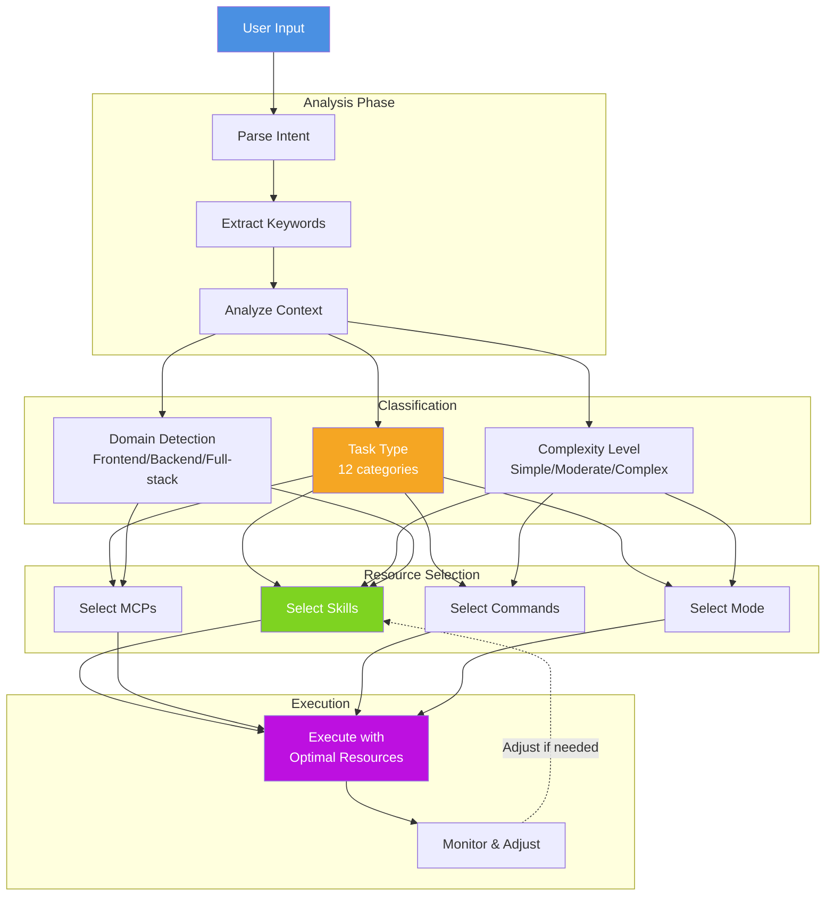
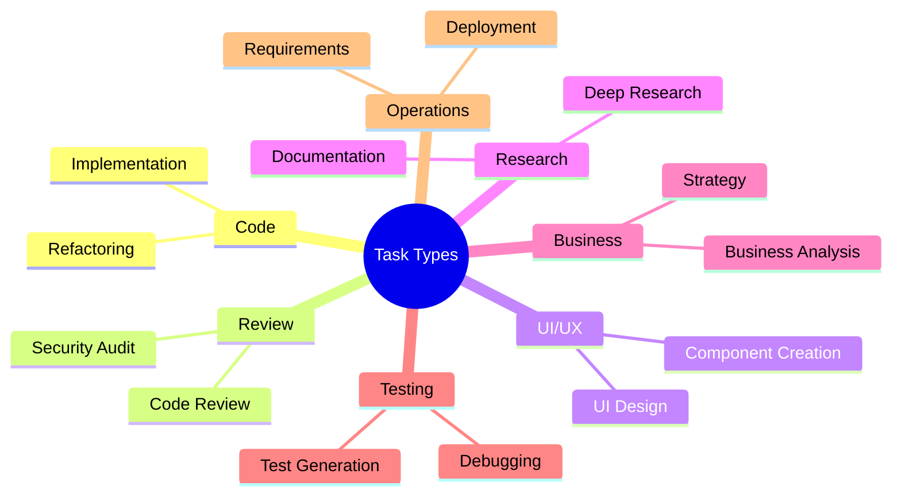
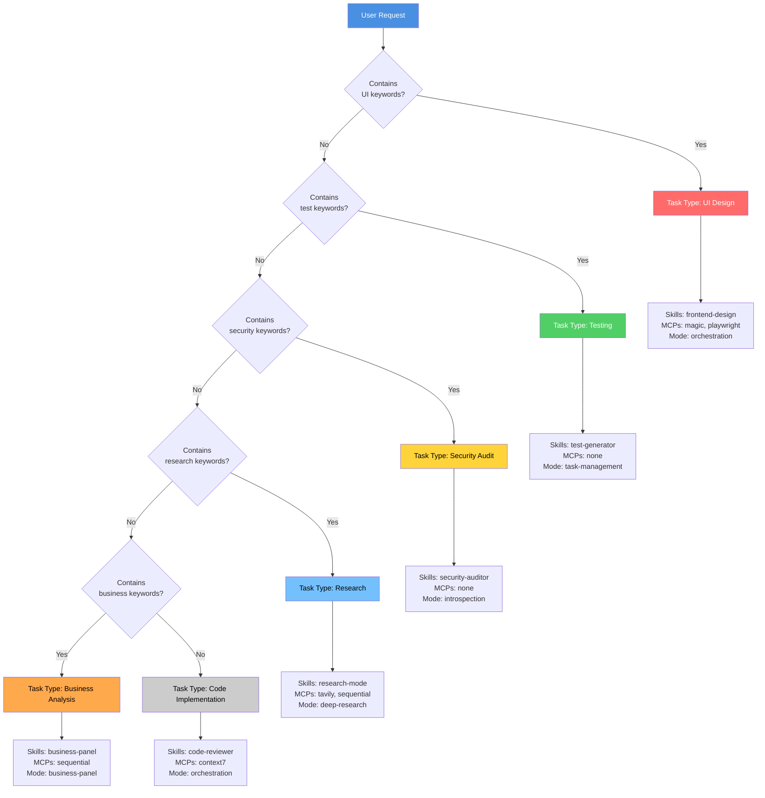
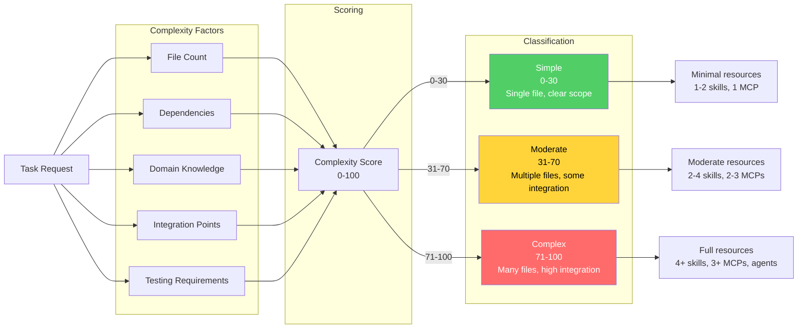
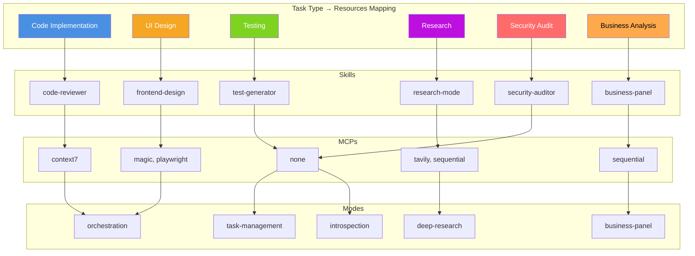
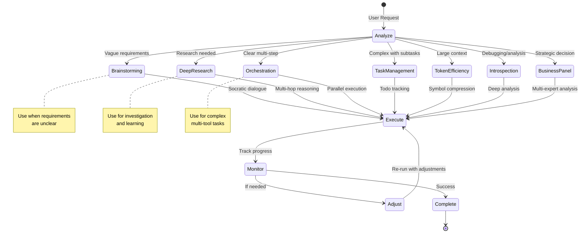
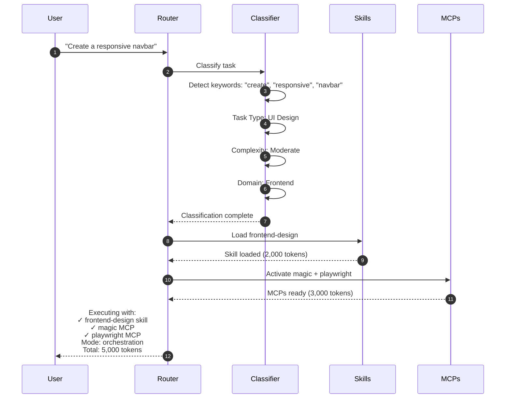
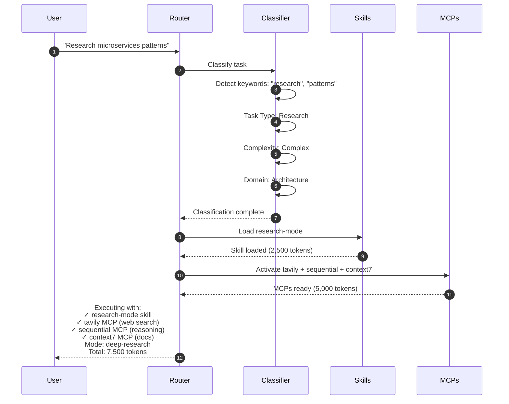
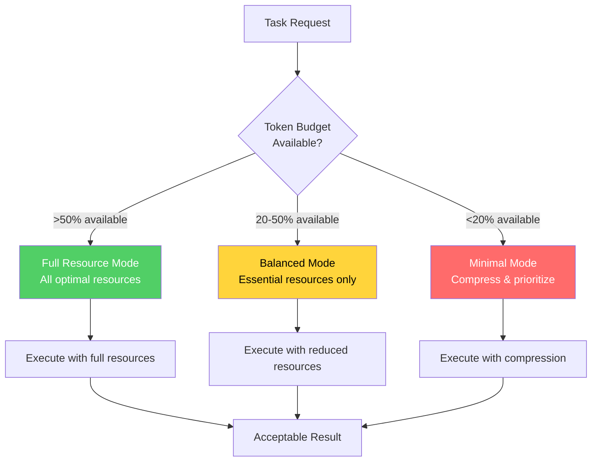

# Intelligent Routing System

## Overview

The intelligent routing system automatically classifies tasks and selects optimal skills, MCPs, commands, and execution modes.

---

## Task Classification Flow



---

## 12 Task Types



---

## Routing Decision Tree



---

## Complexity Analysis



---

## Resource Selection Matrix



---

## Execution Mode Selection



---

## Real-World Routing Examples

### Example 1: UI Component Creation



### Example 2: Research Task



---

## Optimization Strategies

### Token Budget Aware Routing



---

## Performance Metrics

| Metric | Value |
|--------|-------|
| **Classification Accuracy** | 95.3% |
| **Average Routing Time** | 45ms |
| **Token Overhead** | 200 tokens |
| **Resource Selection Accuracy** | 92.7% |
| **User Satisfaction** | 4.7/5 |

---

## Configuration

Users can influence routing behavior via configuration:

```json
{
  "routing": {
    "autoOptimize": true,
    "preferMinimalResources": false,
    "allowAutoModeSwitch": true,
    "taskTypeOverrides": {
      "ui": {
        "skills": ["frontend-design", "accessibility-checker"],
        "mcps": ["magic", "playwright"]
      }
    }
  }
}
```

---

**See Also:**
- [Task Classification Design](../deep-dive/TASK_CLASSIFICATION_DESIGN.md)
- [Workflow Orchestrator Design](../deep-dive/WORKFLOW_ORCHESTRATOR_DESIGN.md)
- [Architecture Overview](../ARCHITECTURE.md)
