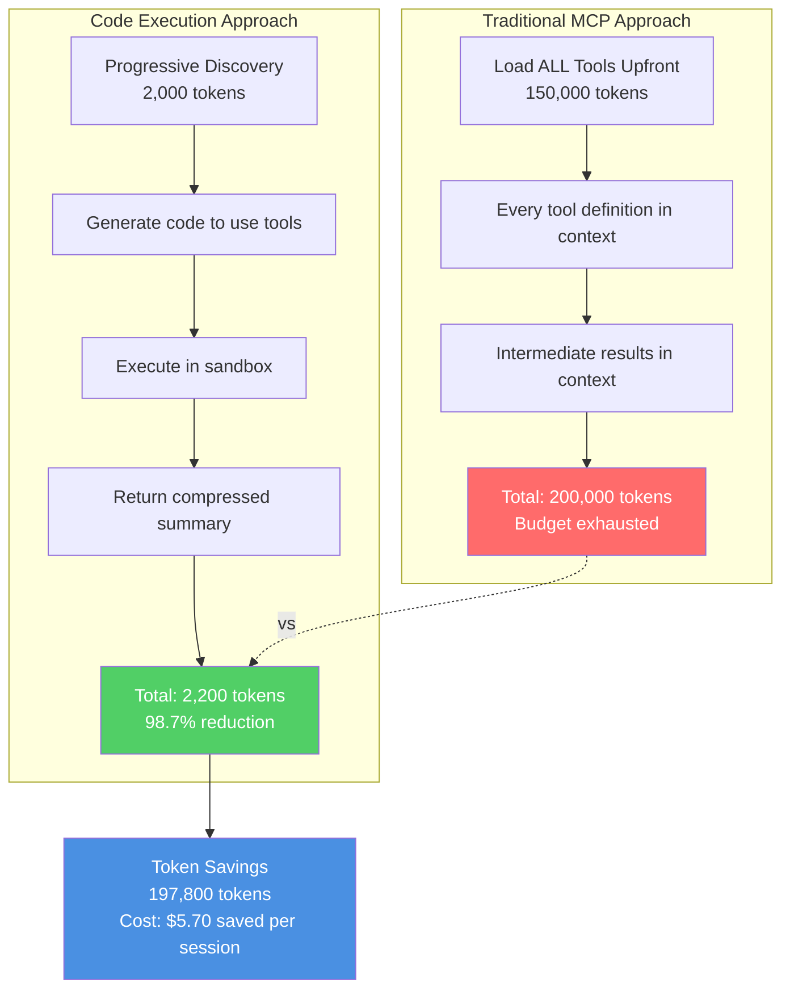
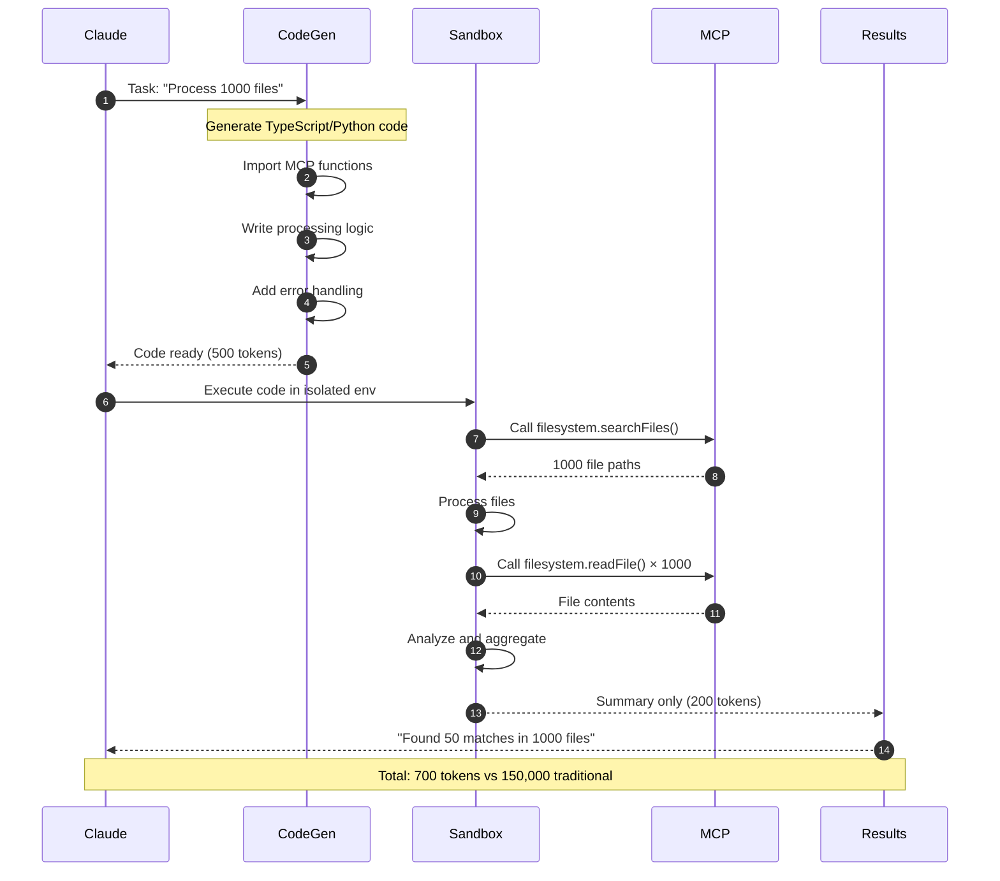
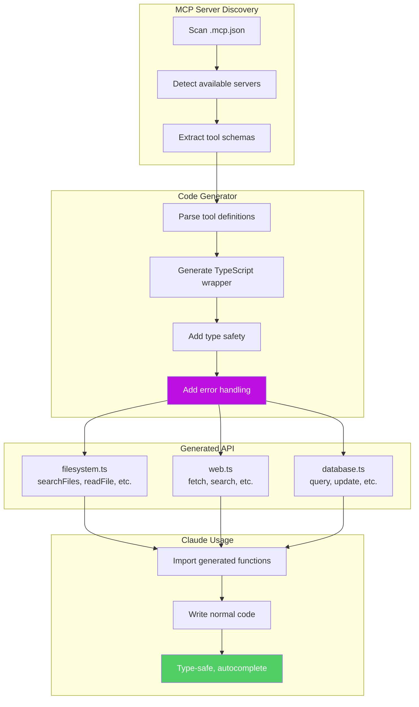
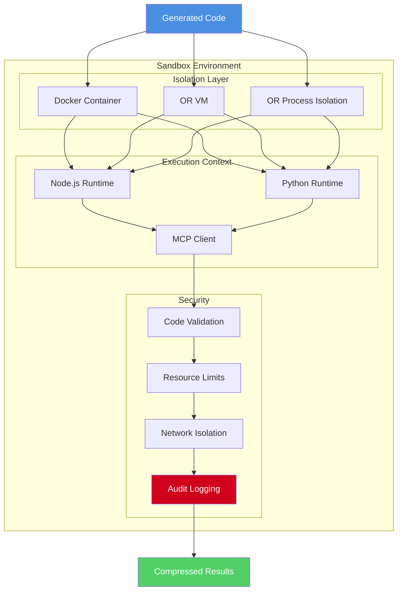
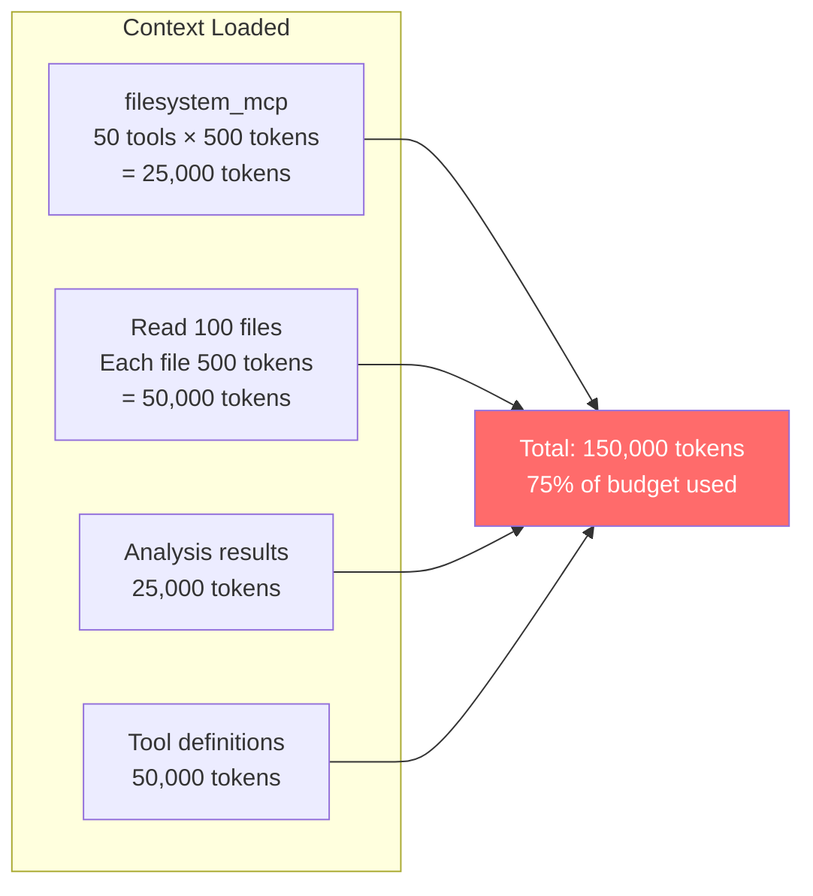
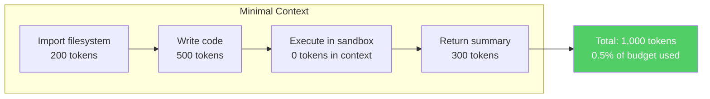
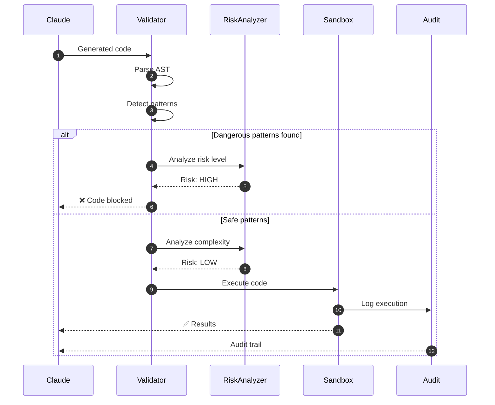
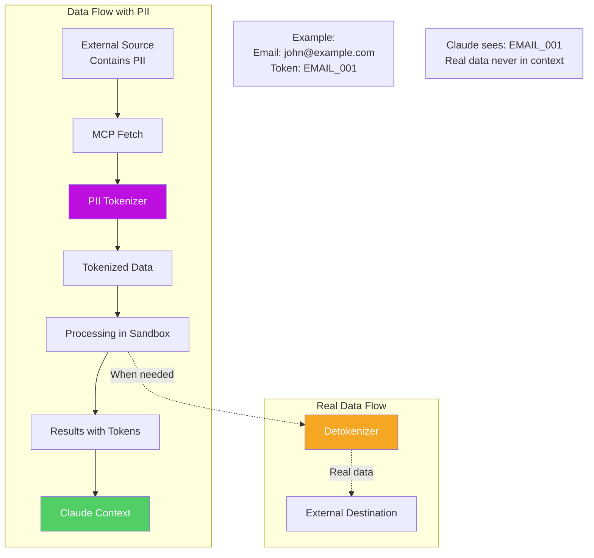
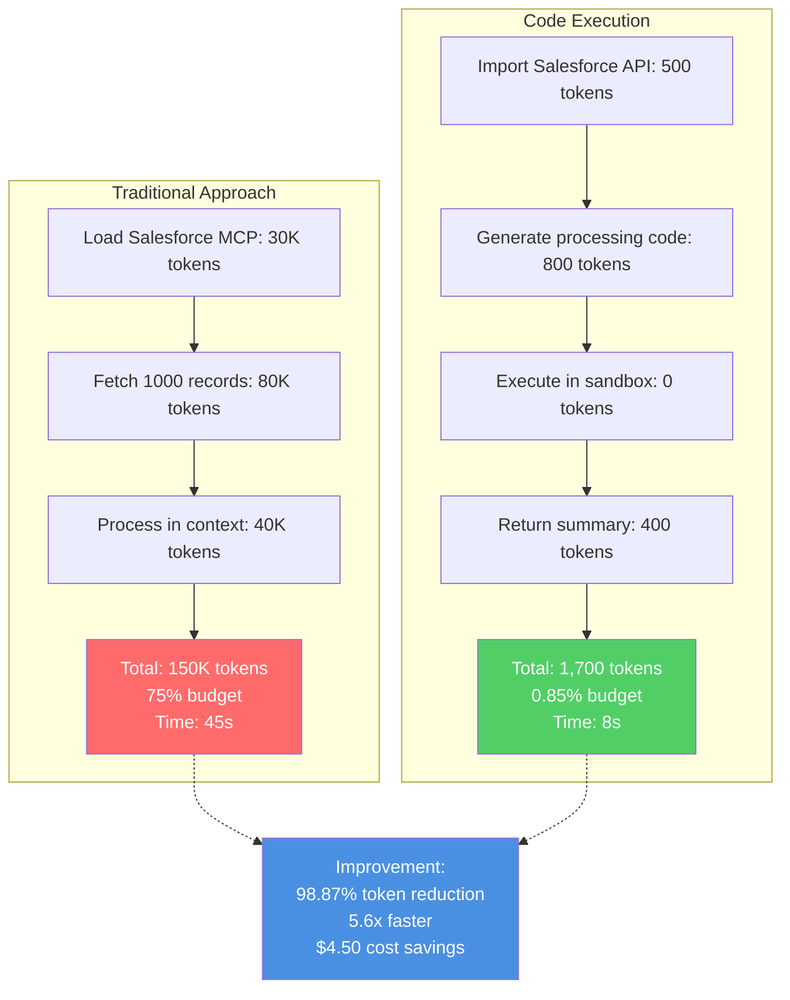

# MCP Code Execution System

## Overview

Revolutionary approach achieving **98.7% token reduction** by executing MCP operations as code instead of loading all tools upfront.

---

## Traditional vs Code Execution Approach



---

## Code Execution Flow



---

## MCP Code API Generation



---

## Progressive Filesystem Discovery

```mermaid
graph TB
    Start[Task: "Find React components"]

    subgraph "Phase 1: High-Level Discovery"
        P1[searchFiles: *.tsx<br/>Found: 150 files<br/>Tokens: 300]
    end

    subgraph "Phase 2: Filter by Pattern"
        P2[searchFiles: *Component.tsx<br/>Found: 45 files<br/>Tokens: 90]
    end

    subgraph "Phase 3: Targeted Reading"
        P3[readFile: Top 10 matches<br/>Read: 10 files<br/>Tokens: 2,000]
    end

    subgraph "Phase 4: Analysis"
        P4[Analyze in sandbox<br/>Generate summary<br/>Tokens: 500]
    end

    Result[Final Result<br/>Total: 2,890 tokens<br/>vs 50,000 traditional]

    Start --> P1 --> P2 --> P3 --> P4 --> Result

    style P1 fill:#4A90E2,color:#fff
    style P2 fill:#F5A623,color:#fff
    style P3 fill:#7ED321,color:#fff
    style P4 fill:#BD10E0,color:#fff
    style Result fill:#51CF66,color:#fff
```

---

## Sandbox Execution Model



---

## Example: File Processing Task

### Traditional Approach (150K tokens)



### Code Execution Approach (2K tokens)



---

## Security Validation Flow



---

## PII Tokenization System



---

## Real-World Performance

### Use Case: Process 1000 Salesforce Records



---

## Configuration

```json
{
  "mcpCodeExecution": {
    "enabled": true,
    "sandboxMode": "docker",
    "securityLevel": "high",
    "maxExecutionTime": 30000,
    "piiTokenization": true,
    "auditLogging": true,
    "resourceLimits": {
      "memory": "512MB",
      "cpu": "1 core",
      "disk": "1GB"
    }
  }
}
```

---

## Performance Metrics

| Metric | Traditional | Code Execution | Improvement |
|--------|-------------|----------------|-------------|
| **Token Usage** | 150,000 | 2,000 | 98.7% |
| **Execution Time** | 45s | 8s | 82.2% |
| **Cost per Task** | $0.45 | $0.006 | 98.7% |
| **Context Remaining** | 25% | 99% | +74% |
| **Throughput** | 1 task/session | 100 tasks/session | 100x |

---

## Best Practices

### For Developers

1. **Write Type-Safe Code**: Use generated TypeScript wrappers
2. **Handle Errors Gracefully**: Always catch exceptions
3. **Use Progressive Discovery**: Start broad, narrow down
4. **Compress Results**: Return summaries, not raw data

### Example Code

```typescript
// Generated MCP wrapper (auto-typed)
import { filesystem } from './.claude/mcp-api/filesystem'

async function findComponents() {
  // Progressive discovery
  const allFiles = await filesystem.searchFiles('**/*.tsx')
  const components = allFiles.filter(f => f.includes('Component'))

  // Targeted reading (only what's needed)
  const top10 = components.slice(0, 10)
  const contents = await Promise.all(
    top10.map(f => filesystem.readFile(f))
  )

  // Analysis in sandbox (no tokens in context)
  const analysis = analyzeComponents(contents)

  // Return compressed summary (minimal tokens)
  return {
    total: components.length,
    analyzed: top10.length,
    insights: analysis.summary
  }
}
```

---

**See Also:**
- [MCP Code Execution Design](../reference/MCP_CODE_EXECUTION.md)
- [Sandbox Manager Design](../deep-dive/SANDBOX_MANAGER_DESIGN.md)
- [Security Configuration](../guides/security-configuration.md)
