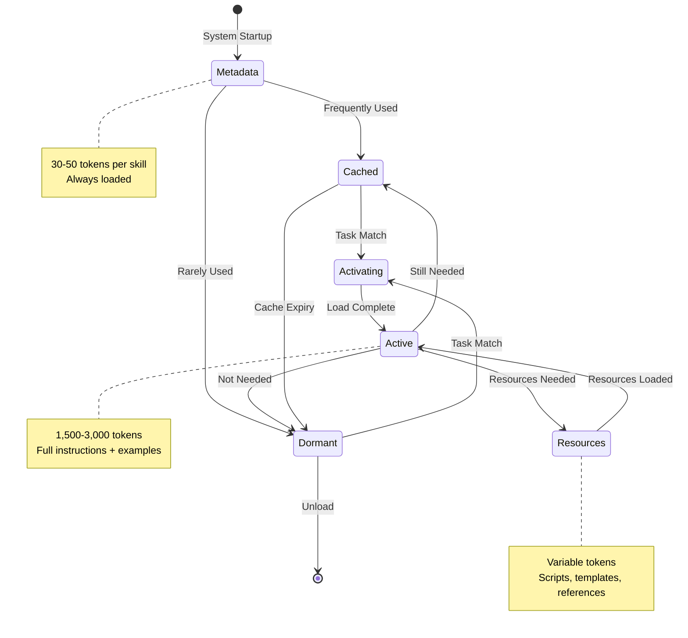
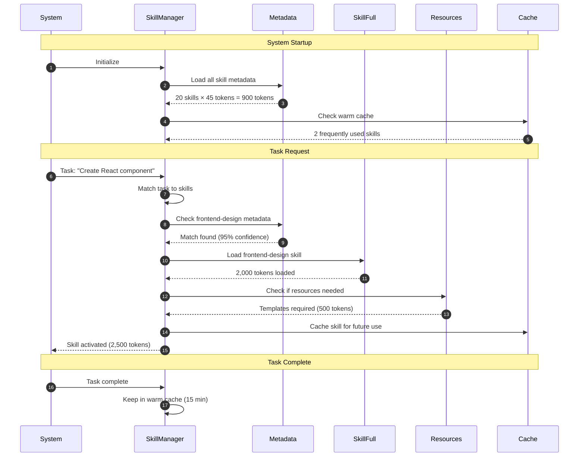
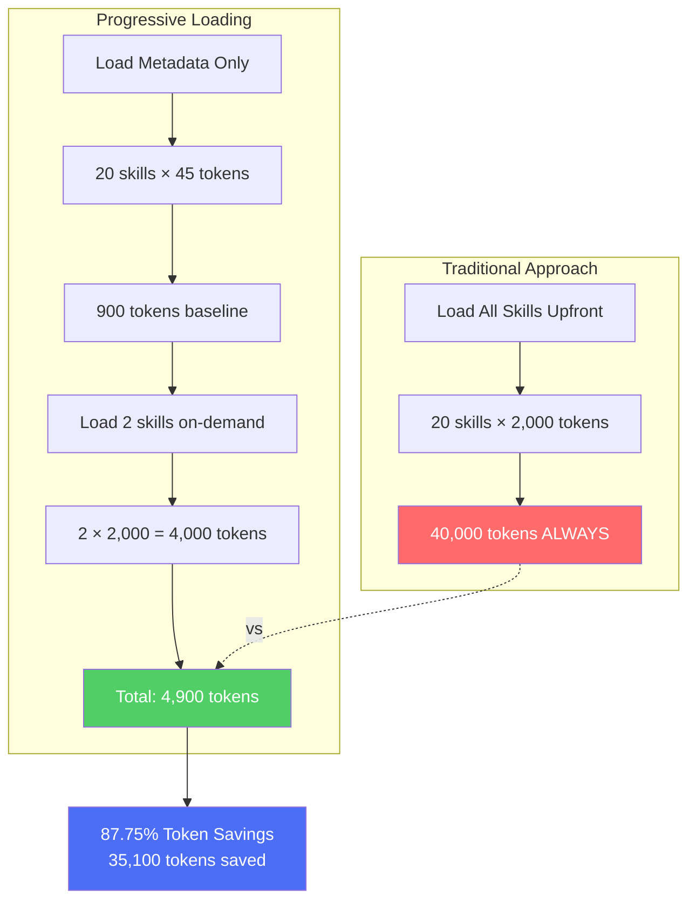
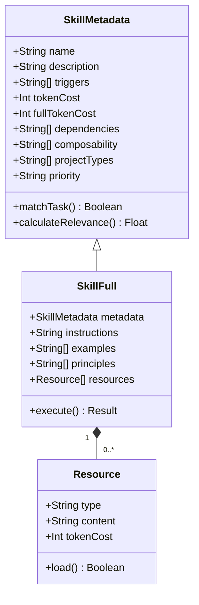
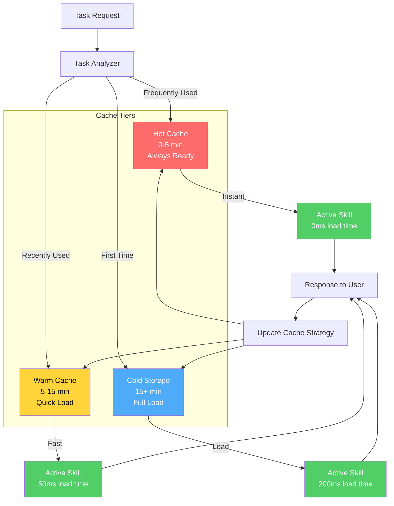
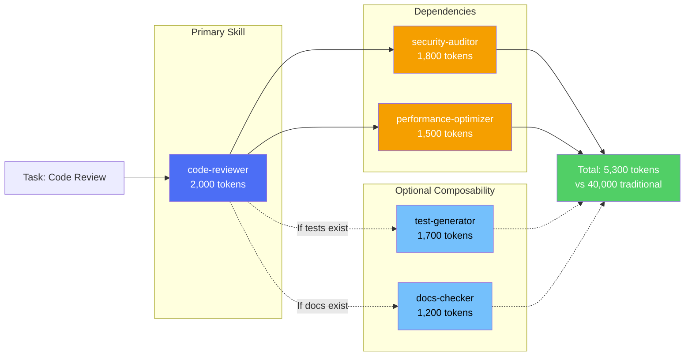

# Progressive Skill Loading System

## Overview

The progressive skill loading system reduces token usage by 95% through intelligent, on-demand skill activation.

---

## Skill Lifecycle

---

## Progressive Loading Flow

---

## Token Savings Calculation

---

## Skill Metadata Structure

---

## Intelligent Caching Strategy

---

## Dependency Resolution

---

## Performance Metrics

| Metric | Traditional | Progressive | Savings |
|--------|-------------|-------------|---------|
| **Baseline Load** | 40,000 tokens | 900 tokens | 97.75% |
| **Average Session** | 40,000 tokens | 4,900 tokens | 87.75% |
| **Peak Session** | 40,000 tokens | 12,000 tokens | 70% |
| **Load Time** | 2,000ms | 50ms (cached) | 97.5% |
| **Memory Usage** | 120MB | 15MB | 87.5% |

---

## Best Practices

### For Users

1. **Let the System Learn**: The more you use the system, the better it caches
2. **Review Metadata**: Check skill descriptions to understand when they activate
3. **Monitor Usage**: Use `/sc:optimize-tokens` to see which skills are loaded

### For Developers

1. **Keep Metadata Minimal**: 30-50 tokens maximum
2. **Clear Triggers**: Define precise trigger patterns
3. **Lazy Resources**: Only load resources when explicitly needed
4. **Test Matching**: Validate skill matching accuracy

---

**See Also:**
- [Token Optimization Guide](../user-guides/08-token-optimization.md)
- [Skills Guide](../user-guides/04-skills-guide.md)
- [Architecture Overview](../ARCHITECTURE.md)
