# Token Budget Management

## Overview

The token budget management system ensures efficient use of the 200K token context window through dynamic allocation, monitoring, and optimization.

---

## Token Budget Allocation


---

## Budget Allocation Strategy


---

## Real-Time Monitoring Dashboard

```mermaid
graph LR
    subgraph "Current Usage"
        U1[System: 2,500 tokens 1.3%]
        U2[MCPs: 6,500 tokens 3.3%]
        U3[Skills: 3,500 tokens 1.8%]
        U4[Messages: 8,000 tokens 4.0%]
        U5[Context: 4,500 tokens 2.3%]
    end

    Total[Total: 25,000 tokens<br/>12.5% used]

    subgraph "Status"
        Status[🟢 Healthy<br/>175,000 available]
    end

    U1 & U2 & U3 & U4 & U5 --> Total
    Total --> Status

    subgraph "Recommendations"
        Rec1[✓ Budget healthy]
        Rec2[✓ No optimization needed]
        Rec3[✓ All systems nominal]
    end

    Status --> Rec1 & Rec2 & Rec3

    style Total fill:#4A90E2,color:#fff
    style Status fill:#51CF66,color:#fff
```

---

## Dynamic Adjustment Flow

```mermaid
sequenceDiagram
    autonumber
    participant Monitor
    participant Analyzer
    participant Optimizer
    participant Resources

    loop Every 5 seconds
        Monitor->>Analyzer: Check token usage
        Analyzer->>Analyzer: Calculate percentages

        alt Usage < 50%
            Analyzer-->>Monitor: Status: Healthy 🟢
        else Usage 50-75%
            Analyzer->>Optimizer: Status: Warning 🟡
            Optimizer->>Optimizer: Analyze loaded resources
            Optimizer->>Resources: Unload rarely used skills
            Resources-->>Optimizer: 2,000 tokens freed
            Optimizer-->>Monitor: Optimized
        else Usage > 75%
            Analyzer->>Optimizer: Status: Critical 🔴
            Optimizer->>Optimizer: Emergency cleanup
            Optimizer->>Resources: Unload non-essential MCPs
            Optimizer->>Resources: Compress message history
            Optimizer->>Resources: Clear temp context
            Resources-->>Optimizer: 15,000 tokens freed
            Optimizer-->>Monitor: Crisis averted
        end
    end
```



---

## Token Saving Strategies


---

## Usage Patterns Over Time


---

## Optimization Triggers


---

## Cost Analysis

### Token Cost Breakdown


---

## Budget Health States


---

## CLI Commands for Budget Management

### View Current Budget
```bash
# Show detailed token breakdown
claude /sc:optimize-tokens

# Output:
📊 Token Budget Status
━━━━━━━━━━━━━━━━━━━━━━━━━━━━━━━━
Total Budget:     200,000 tokens
Current Usage:     25,000 tokens (12.5%)
Available:        175,000 tokens (87.5%)

Breakdown:
├─ System:          2,500 tokens (1.3%)
├─ MCPs (active):   6,500 tokens (3.3%)
├─ Skills (loaded): 3,500 tokens (1.8%)
├─ Messages:        8,000 tokens (4.0%)
└─ Context:         4,500 tokens (2.3%)

Status: 🟢 Healthy
```

### Manual Optimization
```bash
# Force cleanup
claude /sc:cleanup-context

# Compress messages
claude /sc:mode compressed
```

---

## Best Practices

### For Maximum Efficiency

1. **Use Compressed Mode** when possible (30-50% savings)
2. **Monitor Regularly** with `/sc:optimize-tokens`
3. **Enable Auto-Cleanup** in settings
4. **Leverage MCP Code Execution** (98.7% savings)
5. **Use Progressive Skills** (95% savings vs always-loaded)

### Configuration

```json
{
  "tokenManagement": {
    "autoOptimize": true,
    "warningThreshold": 0.5,
    "criticalThreshold": 0.75,
    "autoCleanup": true,
    "compressionMode": "balanced"
  }
}
```

---

## Performance Metrics

| Metric | Traditional | Optimized | Improvement |
|--------|-------------|-----------|-------------|
| **Average Session** | 200K tokens | 20K tokens | 90% |
| **Cost per Session** | $0.60 | $0.15 | 75% |
| **Sessions per Budget** | 1 | 10 | 10x |
| **Context Remaining** | 0% | 90% | +90% |

---

**See Also:**
- [Token Optimization Guide](../user-guides/08-token-optimization.md)
- [Token Efficiency Layer](../reference/TOKEN_EFFICIENCY_LAYER.md)
- [Architecture Overview](../ARCHITECTURE.md)
